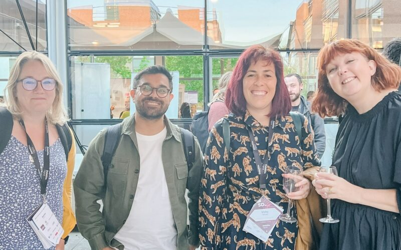
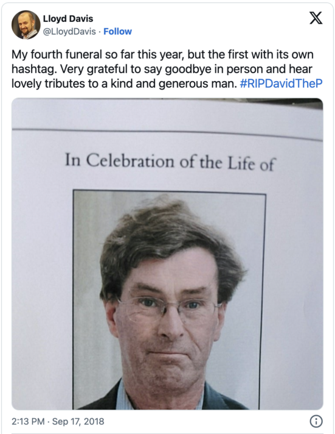

# A tribute to those we lost

by Imran Hussain & James Arthur Cattell

 

UK Gov Camp 2025 ([ukgc25](https://www.ukgovcamp.com/?s=ukgc25)) happens this Saturday. It's a chance to reconnect with friends and colleagues from across the public sector and beyond. Like kindred spirits meeting once a year to reinvigorate each other.

Sadly we’ve learnt that beloved community member [Vicky Teinaki](https://www.vickyteinaki.com/about/) passed away on Thursday 9 January 2025. Vicky planned to be at ukgc25, travelling with fellow UKGovCampers from the North East of England. We imagine she’d made plans with many people, as she was so generous with her time and loved to catch up.

It seems fitting to remember her at ukgc25 this weekend. Many of her friends, colleagues and followers will be in attendance.

## Celebrating Vicky

 Vicky at SD in Gov 2023, with (from left) Martha Edwards, Imran Hussain and Sam Villis.

Earlier this week, we discussed a fitting tribute with some close colleagues and friends of Vicky’s. There was a deluge of ideas, no doubt stemming from the huge affection everyone has for her.

We thought we could celebrate Vicky at ukgc25 with a:

- tribute during the opening ceremony (see [draft here](https://imranhussain.uk/remembering-vicky-teinaki/)), 
- an in-person memorial board for people to add messages,
- there is an [online memorial board here](https://vickyteinaki.muchloved.com/), if you’d like to add messages,
- session to design a memorial sticker.

The latter is inspired by her '[Metaphors we sticker by](https://medium.com/gov-design/metaphors-we-sticker-by-4e4ecdbf8d64)' blog post. 

 

## Remembering more UKGovCampers

Back in 2018, Twitter was still popular among many UKGovCampers. 

So when we suddenly lost [Defra](https://www.gov.uk/government/organisations/department-for-environment-food-rural-affairs) web master [David Pearson](https://x.com/davidthep/with_replies) in August that year, the Twitter hashtag [#RIPDavidTheP](https://x.com/hashtag/RIPDavidTheP) is where we organised and shared memories of David.

[https://x.com/LloydDavis/status/1041676504189607936](https://x.com/LloydDavis/status/1041676504189607936)

Defra colleague [Mat Banks](https://x.com/matbanks123) set up a [Just Giving](https://www.justgiving.com/fundraising/david-pearson-memory) page after speaking with David’s family and we raised £1,663 from 71 people for the [British Heart Foundation](https://www.bhf.org.uk/). 

There was a [session at ukgc19](https://x.com/jaCattell/status/1086628276326547458) to discuss a memorial award for “outstanding content on a public sector website” in David’s name, which he would have found highly amusing. 

Who else have we lost from the GovCamp community over the years? How should we collectively remember them at ukgc25 and beyond, please? 

Please share your ideas in the comments below, on socials using #ukgc25 or email us at [organisers@ukgovcamp.com](mailto:organisers@ukgovcamp.com). 

Imran and James.
