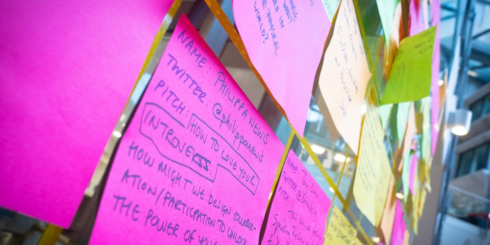

With just two months to go until GovCamp 2021, your [merry band of organisers](https://www.ukgovcamp.com/about/) have been getting together to plan the event.  

 

As you might expect, there are changes to the 2021 edition. We can’t imagine not having a big, in-person shindig, but bringing you all together virtually is the safest and most sensible way for us to have the event. We all need GovCamp goodness more than ever, so having a [fallow year](https://en.wikipedia.org/wiki/Fallow) just wasn’t an option!

 

**In 2021, we’re going to have a GovCamp Festival and spread it out over a week.** Doing this gives you the flexibility to join the sessions that best suit you and it means you won’t cram everything into one exhausting day.  GovCamp Festival will be from **18th January - 23rd January,** with an opening and closing get together for the entire community.

 

We asked you to [share what makes GovCamp special for you](https://twitter.com/UKGovCamp/status/1283464200355033090). You said:

- the people
- the sense of community and comradery
- bringing new people into the community
- the inclusivity of the event
- meeting your Twitter heroes. 

We know that’s going to be hard to recreate online, so we need your support to help make this an awesome festival for all.

 

There won’t be a lottery but you need to sign up to the event. **You can sign up from now until the 18th December via this link:** [https://docs.google.com/forms/d/e/1FAIpQLSftkBcYvX2YV5gW1smGuW5VqBedZTdjbp-lec6ocEvAQ4nLPA/viewform](https://docs.google.com/forms/d/e/1FAIpQLSftkBcYvX2YV5gW1smGuW5VqBedZTdjbp-lec6ocEvAQ4nLPA/viewform)

 

We will then add you to our [GovCamp Google Group](https://groups.google.com/g/ukgc21) where you’ll find all the information you need about the festival, discuss ideas you have for sessions you (or others) should run, find out how to pitch sessions, as well as anything else you’re curious about.

 

We are also **reviewing our** [**code of conduct**](https://www.ukgovcamp.com/code-of-conduct/) to make sure it makes sense in a virtual event world.

 

There will be **social events,** such as _Cheeseday Tuesday_ (bring your favourite cheese, crackers, nibbles, tipples and share your love for cheese with fine connoisseurs); space for corridor camp; and I’m sure we’ll have teetotal camp / just a few tipples camp / shots for [Esko](https://twitter.com/reinikainen) camp. 

 

Essentially, our two key principles for UKGC21 are:

- Trust the crowd
- Create space for fun (chaos)

 

We will still need **sponsorship** to provide bursaries for those who need them, grants for other events, and cover any other costs (such as technology being used, which we’ll be open about).  You can see the events that sponsorship funding has supported at [https://www.ukgovcamp.com/category/support-events/](https://www.ukgovcamp.com/category/support-events/). 

You can apply for a grant for your own event at [https://www.ukgovcamp.com/grants](https://www.ukgovcamp.com/grants). 

You can contact us about sponsorship at: [sponsors@ukgovcamp.com](mailto:sponsors@ukgovcamp.com) 

 

**Okay, sounds great! What do I need to do next?**

 

- **If you’d like to register for the event, sign up here: [https://forms.gle/qDJcjiUyqHFKcKpXA](https://forms.gle/qDJcjiUyqHFKcKpXA)**

 

- If you’re able to sponsor the event, please share your details here [https://www.ukgovcamp.com/become-a-sponsor/](https://www.ukgovcamp.com/become-a-sponsor/)
