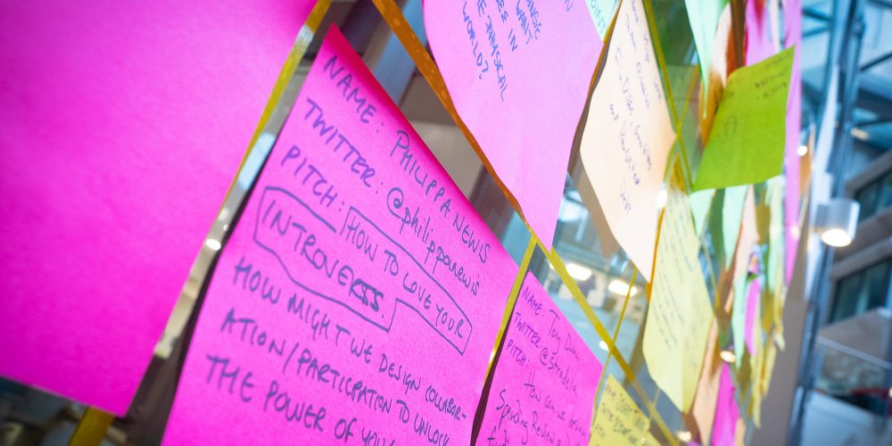

**Quick summary:**

- UKGovcamp will return on **Thursday 20th January - Saturday 22nd January 2022** (location: virtual, hashtag [#UKGC22](https://twitter.com/hashtag/UKGC22?src=hashtag_click))
- Please read our code of conduct: [https://www.ukgovcamp.com/code-of-conduct/](https://www.ukgovcamp.com/code-of-conduct/) 
- You can register for the event now: [https://bit.ly/ukgc22form](https://bit.ly/ukgc22form)

\_\_\_\_\_\_\_\_\_\_\_\_\_\_\_\_\_\_\_\_\_\_\_\_\_\_\_\_\_\_\_\_\_\_\_\_\_\_\_\_\_\_\_\_\_\_\_\_\_\_\_\_\_\_\_\_\_\_\_\_\_\_\_\_\_\_\_\_\_\_\_\_\_\_\_\_

### **We’re back, back, back again!**

Hi-de-Hi Campers,

You’ll be delighted to hear that UKGovcamp returns in January 2022! We (your [merry band of organisers](https://www.ukgovcamp.com/about/)) have decided to invite you virtually for another year.  

We’re keeping some things similar to 2021, and making some changes for 2022.  We’re really proud of the event we put on in 2021 - which we simply couldn’t have done without our campers (attendees), campmakers (volunteers), session pitchers and sponsors. So thank you very much.

In 2022, we’re still going to run the event over a number of days. **UKGovcamp will run from Thursday 20th January - Saturday 22nd January.**  

Thursday will be our dedicated day of testing our - and your - tech setup, virtual and in-person socials (the iconic CheeseCamp will return!) and organised fun. Friday and Saturday will be full days of sessions from 0900 - 1600. Plus we’ll have an opening and closing get together for the entire community.  

Doing this way gives you the flexibility to join the days and sessions that best suit you and you won’t need to cram everything into one exhausting day. So please don’t be put off if you can only come for one day, a half day, an hour. We still want you to join us!

### **But wait, I have no idea what Govcamp is...**

If you haven’t been to UKGovcamp before, we recommend reading these blog posts from previous events by our fellow campers, which should give you an idea of what to expect. 

These have been shaped around our in-person events, so things will be a little different online.

- This comprehensive experience of [what to expect at Govcamp](https://blog.weareconvivio.com/what-to-expect-at-ukgovcamp-ecc37191dc81) by [Steve Parks](https://twitter.com/steveparks)
- At [Govcamp it’s okay to..](https://geekwonkinterface.wordpress.com/2016/06/14/its-ok/) by [Lucy Knight](https://twitter.com/Jargonautical)
- [Reflections from UKGC19](https://medium.com/@dasbarrett/uk-govcamp-2019-reflections-c2eb14c782a2) by [Dan Barrett](https://twitter.com/dasbarrett) 
- [Sharing what I learnt from Govcamp](https://dwpdigital.blog.gov.uk/2018/02/19/sharing-what-i-learnt-at-ukgovcamp/) by [Debbie Blanchard](https://twitter.com/DebBlanch44)

The day is for you. It’s a unique experience, that you shape. 

Usually we start the day with in-person pitching. As we’ll be online in 2022, attendees will pitch sessions in advance (we will open pitching in January and close a week before the event to give us enough time to build the session grid and setup the virtual spaces) and you'll be able to pick and choose the sessions you want to attend. 

### **Tickets please!**

Because we’re not restricted by venue or location, there won’t be an event lottery to allocate tickets but you’ll still need to register to receive entry to the event. 

**You can sign up now until via this link:** [**UKGovcamp 2022 Ticket Registration**](https://bit.ly/ukgc22form)

We will then add you to our distribution list where we’ll share with you all the information you need about UKGovcamp 2022, find out how to pitch sessions, as well as anything else you’re curious about. You’ll also want to [join our Slack group](https://ukgovcamp.slack.com/join/shared_invite/enQtNTIyMTIxMTc1MDcyLWQzNjg3YTdhMzRlMDdlYWY5OTFlY2Y2NWNiODY1ZGI5YWUxMWQ4YTFhNzAxYzhkODlmZWY1ZDI1YjBjNmY1MGY) where you can ‘meet’ folks early and discuss ideas you have for the sessions you (or others) should pitch.

### **Help us to make UKGovcamp 2022 awesome!**

In 2021 we reviewed our [**code of conduct**](https://www.ukgovcamp.com/code-of-conduct/) to make sure it made sense in a virtual event world. We have reviewed that again, so please do check it before registering.

We will still need [**sponsorship**](https://www.ukgovcamp.com/become-a-sponsor/) to provide bursaries for those who need them, grants for other events, and cover any other costs (such as technology being used) which we’ll be open about.  

You can see the events that sponsorship funding has supported at [https://www.ukgovcamp.com/category/support-events/](https://www.ukgovcamp.com/category/support-events/)

You can apply for a grant for your own event at [https://www.ukgovcamp.com/grants](https://www.ukgovcamp.com/grants)

You can contact us about sponsorship at: [sponsors@ukgovcamp.com](mailto:sponsors@ukgovcamp.com) 

### **Okay, sounds great! What do I need to do next?**

- If you’d like to register for the event, sign up here: [UKGovcamp 2022](https://bit.ly/ukgc22form) 
- If you’re able to sponsor the event, please share your details here [https://www.ukgovcamp.com/become-a-sponsor/](https://www.ukgovcamp.com/become-a-sponsor/)
- You can also add to our [Govcamp grove](https://treesforlife.org.uk/groves/96110/) which will plant trees in the Highlands of Scotland, providing space for wildlife to flourish and communities to thrive.
