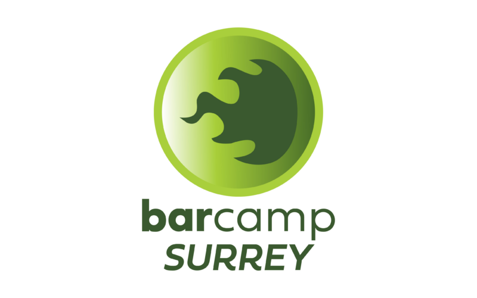

Laura Czajkowski successfully applied to the UKGovCamp grant fund for help with their Surrey event on Saturday 2 August 2025.

 BarCamp Surrey

#### [Grant fund](https://www.ukgovcamp.com/grants/) application:

 

**Name**: Laura Czajkowski.

**Your email**: [laura.czajkowski@gmail.com](mailto:laura.czajkowski@gmail.com)

**Event**: [BarCamp Surrey](https://barcampsurrey.org/)

**Description**: A one-day, community-driven Barcamp in Surrey, where individuals passionate about technology can gather, share knowledge, and learn from one another in an open and inclusive environment. There will be no pre-planned schedule; attendees will propose and deliver talks on topics they’re passionate about, ranging from beginner-friendly to advanced technical discussions. Whether you’re an enthusiast, a hobbyist, or a seasoned professional, everyone is welcome. Focus Areas:

- Technology in Everyday Life: Topics like smart home setups, favorite gadgets, and practical tips,
- Project Spotlights: Sharing personal projects, open-source contributions, or GitHub repositories,
- Special Interests: Niche topics such as HAM radio, retro tech, or innovative DIY tech ideas,
- Offline Hobbies: Knitting, calligraphy, ‘zines.

Skill Levels: Tailored talks for beginners, intermediates, and experts.

The event aims to foster a welcoming, collaborative, and curious environment, celebrating the diversity of interests within the tech community.

[Tickets available via website](https://barcampsurrey.org/).

**Amount requested**: £750.

**What the funding will be used for**: We will allocate it to cover the venue hire first, and the remaining funds will go toward event facilities, including flip charts, sharpies, post-it notes, and other essentials.

**About you, what you do, and your interest in running this event**: The event is being organized by two experienced professionals: Laura Czajkowski, based in Godalming, who serves as the Head of Community at DragonflyDB, a database company. With over 20 years of experience in building communities and managing events, Laura brings a wealth of knowledge to this initiative. Joining her is Alan Pope, who leads Developer Relations at Anchore. Alan has been a prominent figure in the UK open source community for more than three decades and has successfully cultivated vibrant and thriving podcast communities. Together, we believe this event offers a fantastic opportunity for people in Surrey to connect, network, and learn in a welcoming and inspiring environment.

 

#### Feedback from [UK Gov Camp Slack](https://join.slack.com/t/ukgovcamp/shared_invite/zt-30z3ah4o2-QFW9vHJ69w94ywglIYPXZw) members:

Once an application is received, it's posted in the [#grant-fund channel](https://ukgovcamp.slack.com/archives/C087MH5D84X) for members to discuss and vote on.

The application was [posted in Slack on Tuesday 25 February 2025](https://ukgovcamp.slack.com/archives/C087MH5D84X/p1740499672126299).

It received 2 👍 approvals and 2 👎 rejections.

The treasurer has a [casting vote](https://en.wikipedia.org/wiki/Casting_vote) and decided to approve the request.
