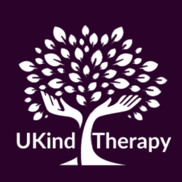

Amanda Haigh has successfully applied to the UKGovCamp grant fund for their event.

 UKind Therapy logo

[Grant fund](https://www.ukgovcamp.com/grants/) application: 

**Name**: Amanda Haigh.

**Your email**: [amanda@ukindtherapy.io](mailto:amanda@ukindtherapy.io)

**Event**: Bridging the gap in therapy for domestic abuse services.

**Description**: This October, during Domestic Abuse Awareness Month, we will host a survivor- and service-led event to share the outcomes of our UKind Therapy XR clinical research. The event will celebrate the five frontline services that took part in the research, highlighting their role in testing a new trauma-informed VR (Virtual Reality) therapy model for survivors.

We’ll showcase survivor stories, service impact, and how immersive technology is helping bridge the mental health support gap in domestic abuse services. The event will bring together researchers, service staff, survivors, and system leaders to explore how digital therapy can transform trauma recovery and reduce pressure on frontline teams.

**Amount requested**: £750.

**What the funding will be used for**: With GOV Camp support, we will cover venue costs, refreshments, survivor travel, and create a short film of the event to share nationally. The event reflects GOV Camp’s values of digital inclusion, service innovation, and public impact.

**About you, what you do, and your interest in running this event**: I'm Amanda Haigh, founder of UKind Therapy CIC and a survivor of domestic and narcissistic abuse. I’ve spent the past three years developing UKind Therapy XR, a trauma-informed virtual reality therapy tool designed to support healing for survivors where traditional services are overstretched or inaccessible.

Before this, I led advocacy work for learning-disabled adults and now focus on social innovation that bridges lived experience with digital tools. I run an empowerment programme helping survivors rebuild their confidence through entrepreneurship.

This event means a lot to me personally and professionally — it’s a way to celebrate our frontline partners and survivors who’ve helped co-design this groundbreaking work, and to raise awareness about trauma recovery options during Domestic Abuse Awareness Month. I believe GOV Camp support could help us amplify these voices and share a national message of innovation, inclusion, and hope.

 

#### Feedback from [UK Gov Camp Slack](https://join.slack.com/t/ukgovcamp/shared_invite/zt-30z3ah4o2-QFW9vHJ69w94ywglIYPXZw) members:

Once an application is received, it's posted in the [#grant-fund channel](https://ukgovcamp.slack.com/archives/C087MH5D84X) for members to discuss and vote on.

The application was [posted in Slack on 24 March 2025](https://ukgovcamp.slack.com/archives/C087MH5D84X/p1742852467702829).

It received 6 👍 approvals and 3 👎 rejections.
