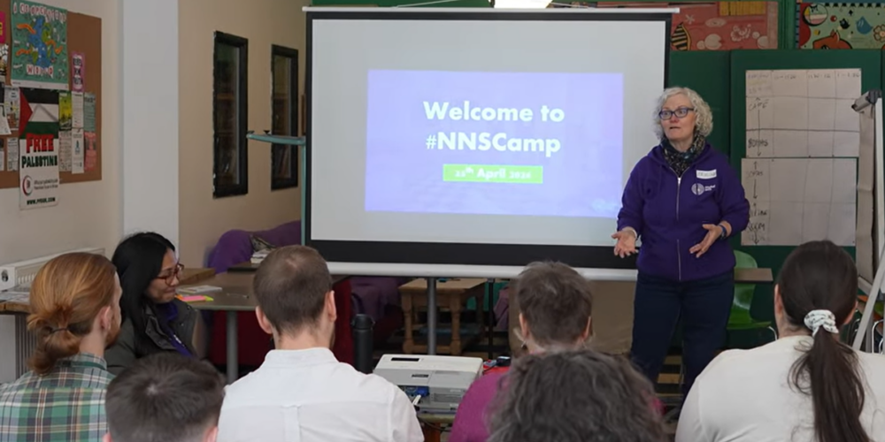

Pauline Roche successfully applied to the UKGovCamp grant fund for help with their 2025 event.

 NNS Camp 2024

#### [Grant fund](https://www.ukgovcamp.com/grants/) application:

 

**Name**: Pauline Roche.

**Your email**: [pauline@northfieldcommunity.org](mailto:pauline@northfieldcommunity.org)

**Event**: [Brum Connected Camp](https://www.tickettailor.com/events/digitalnns/1653201) (previously NNS Camp 2025).

**Description**: An unconference for reps from NNS's in Birmingham including Digital NNS and their support networks e.g. Community Network Support Officers, Community Digital Skills Network members, social prescribers, other people involved in supporting NNSs e.g. commissioning team members.

**Amount requested**: £1,000.

**What the funding will be used for**: Venue hire and catering.

**About you, what you do, and your interest in running this event**: I am an amplifier, producer, relationship broker and freelance journalist with a Digital Inclusion/Open data portfolio, working for Digital NNS in Birmingham as the Community Lead supporting Neighbourhood Network Schemes (NNSs) to maximise opportunities for digital inclusion in neighbourhoods; I produce and co-present the weekly Dr Tech Show with Sweyn Hunter and am a co-organiser of Open Data Camp (also funded and supported by UK Gov Camp); I have previously run VCSS Camp and received support for that from UK Gov Camp; we at Digital NNS introduced the unconference concept to the NNS's last year through the first NNS Camp in April 2024 (kindly funded by a UK Gov Camp grant) and at least one NNS has since run their own version of an unconference, and we want to build on this, involving local hyperlocal media; we will again offer them opportunities to discuss new ideas, network and collaborate for the benefit of assets and citizens they all support; the event will again broadly cover transparency, engagement, service delivery and collaboration involving technology, and the theme this year will be Digital Inclusion.

**Tickets**: [https://www.tickettailor.com/events/digitalnns/1653201](https://www.tickettailor.com/events/digitalnns/1653201)

 

#### Feedback from [UK Gov Camp Slack](https://join.slack.com/t/ukgovcamp/shared_invite/zt-30z3ah4o2-QFW9vHJ69w94ywglIYPXZw) members:

Once an application is received, it's posted in the [#grant-fund channel](https://ukgovcamp.slack.com/archives/C087MH5D84X) for members to discuss and vote on.

The application was [posted in Slack on Wednesday 26 February 2025](https://ukgovcamp.slack.com/archives/C087MH5D84X/p1740608078881079).

It received 5 👍 approvals and 0 👎 rejections.
