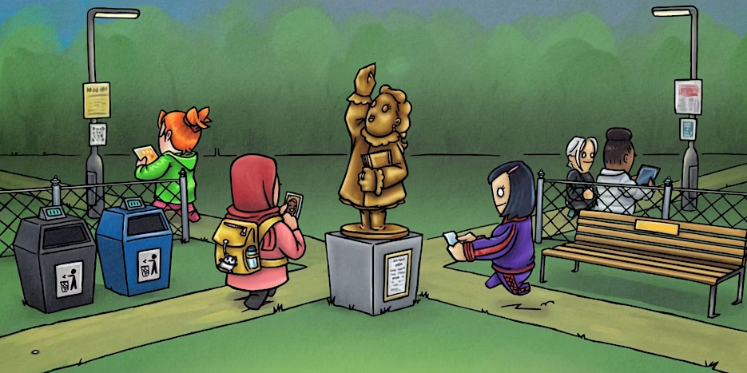

Jodie Keens successfully applied to the UKGovCamp grant fund for help with their London event on Saturday 31 May and Sunday 1 June 2025.

 Tackling Violence against Women and Girls in Public Spaces Hackathon

#### [Grant fund](https://www.ukgovcamp.com/grants/) application:

 

**Name**: Jodie Keens.

**Your email**: [tech.tackling.vawg@gmail.com](mailto:tech.tackling.vawg@gmail.com)

**Event**: [Combatting Violence Against Women and Girls (VAWG) in public spaces hackathon](https://www.eventbrite.co.uk/e/tackling-violence-against-women-and-girls-in-public-spaces-hackathon-tickets-1224875137509)

**Description**: This is a volunteer-run two-day civic technology weekend hackathon in May/June. It will focus on applying design thinking to solve problems related to violence against women and girls in public spaces. It will begin with subject matter expert speakers sharing their knowledge and perspectives, then two design challenges (based on extensive research of women’s experiences of feeling and being unsafe and how they currently use technology to try and improve this) will be presented to frame the hackathon’s activities. Participants will choose which challenges they’d like to ideate and prototype solutions for, then they’ll pitch their ideas for how to address them. Groups will form to collaboratively work on each idea and prototype; this work will constitute as the main part of the hackathon. At the end of the weekend each group will present their ideas and prototypes, these will be judged by subject matter experts and prizes will be awarded.

The hackathon will support progress towards designing technologies to decrease violence and against women and girls in public spaces. Research shows that there are vast issues with current technology intended to support women’s safety, which also means there are vast opportunities for improving this problem for society. This is an inclusive event so we’re inviting anyone interested in supporting progress towards combatting women’s safety in public spaces to get involved! This includes people with an interest or experience in combatting VAWG, designers, developers, researchers, data scientists, students, academics or criminologists.

[Tickets available on Eventbrite](https://www.eventbrite.co.uk/e/tackling-violence-against-women-and-girls-in-public-spaces-hackathon-tickets-1224875137509).

**Amount requested**: £750.

**What the funding will be used for**: Materials for the event, food and refreshments for participants and subject matter expert speakers; venue hiring; travel expenses for subject matter experts; digital archive of the hackathon’s outcomes.

**About you, what you do, and your interest in running this event**: My name’s Jodie Keens and I’m a Senior User Researcher at the Central Digital and Data Office in the Cabinet Office. I researched and wrote my MSc Human-Computer Interaction thesis on Women’s Safety in Public Spaces: Investigating Women’s Experiences and Interactions with Technology to Combat Feeling and Being Unsafe. This involved a large-scale survey, autoethnography of using current women’s safety technologies in real-life situations and using co-design to ideate solutions for these issues. It’s currently in the process of being submitted for publishing. Aneesha Singh, a subject matter expert for researching technologies designed to support women, Associate Professor and Programme Director of MSc Human-Computer Interaction at UCL and a previous expert speaker who presented to GDS researchers, is also a volunteer supporting the event. Social justice hackathons stimulate more thinking, collaboration, events and ideas to combat issues affecting members of the public. This event is intended to promote these longer-term effects as well as the ideas and prototypes which will be produced at the event.

 

#### Feedback from [UK Gov Camp Slack](https://join.slack.com/t/ukgovcamp/shared_invite/zt-30z3ah4o2-QFW9vHJ69w94ywglIYPXZw) members:

Once an application is received, it's posted in the [#grant-fund channel](https://ukgovcamp.slack.com/archives/C087MH5D84X) for members to discuss and vote on.

The application was [posted in Slack on Tuesday 25 February 2025](https://ukgovcamp.slack.com/archives/C087MH5D84X/p1740495736660859).

It received 6 👍 approvals and no 👎 rejections.
