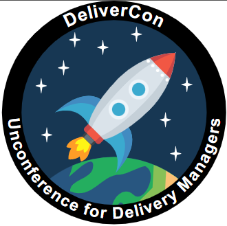

Samuel Hoskin successfully applied to the UKGovCamp grant fund for their 21 May 2025 event in York.

 The Deliver Con logo

#### [Grant fund](https://www.ukgovcamp.com/grants/) application:

 

**Name**: Samuel Hoskin.

**Your email**: [info@delivercon.uk](mailto:info@delivercon.uk)

**Event**: DeliverCon 2025.

**Description**: DeliverCon is unconference intended for Delivery Managers (DM) in and around the public sector (including suppliers). It staple event in the DM calendar being incepted in 2018. On the 21st of May 2025, we will hold another event for approx. 200 delivery managers in York, Enabling them to come together, learn from each other, discuss common problems and network across organisation boundary's.

Website = [https://delivercon.uk/](https://delivercon.uk/)

**Amount requested**: £500.

**What the funding will be used for**: We will use this money to fund lunch for attendees, we find by offering lunch, it encourages people to network more with people they don't know compared to heading off to buy lunch with colleagues they already knew. We will also use a portion of the funds for incidentals such as stationary, stickers etc.

**About you, what you do, and your interest in running this event**: I am Delivery Manager that has been helping out with organising DeliverCon since 2022. I work with a team of other great DM's from across government in pulling together this event. My interest is that this a great event (I might be bias) that allows DM's to come together and talk about agile in government and how we can do things better.

 

#### Feedback from [UK Gov Camp Slack](https://join.slack.com/t/ukgovcamp/shared_invite/zt-30z3ah4o2-QFW9vHJ69w94ywglIYPXZw) members:

Once an application is received, it's posted in the [#grant-fund channel](https://ukgovcamp.slack.com/archives/C087MH5D84X) for members to discuss and vote on.

The application was [posted in Slack on 11 March 2025](https://ukgovcamp.slack.com/archives/C087MH5D84X/p1741712290940489).

It received 9 👍 approvals and 0 👎 rejections.
