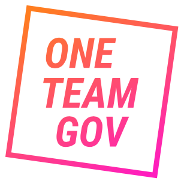

 OneTeamGov logo

**Description of the event**: Our discovery question is "leadership for what?" which is also the theme of our opening talk from Dr. Clare Price-Dowd, Head of Insights, research and evaluation at the NHS Leadership Academy. We'll then break into groups for discussions using either lean coffee or open space technology. A vegan and gluten free lunch will be provided. The afternoon will combine empathy mapping, story boarding and other activities. [Read more at our blog post](https://medium.com/oneteamgov/exploring-future-leadership-discovery-workshop-b9e1af02cd26).

**How much funding are you looking for?** £500

**What do you expect the funding will be used for?** Catering

**Please tell us a bit about yourself?** I work in the civil service as a delivery manager. I'm currently at Defra where I work on digital innovation. I'm [@jacattell](https://twitter.com/jaCattell) on Twitter
