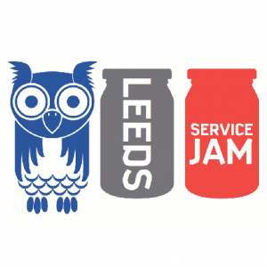

 Leeds Service Jam logo

**Description of the event:** The [Global Service Jam](http://planet.globalservicejam.org/) is an opportunity for those interested in learning about Service Design through tackling a current Service Design challenge over 2.5 days (March 29th-31st). The event is run and facilitated by volunteers with experience and a passion for Service Design - the ethos is ‘doing not talking’ so participants will be exposed to and encouraged to use a range of end-to-end Service Design Tools including personas, customer journey canvasses, prototyping and a business canvas. Attendees will present their idea at the end of the Jam, whilst uploading collateral and learning accrued over the weekend to the [Global Service Jam site](http://planet.globalservicejam.org/) so that all those participating around the world can see the progress and finished prototype. The Jam is open to anyone looking to bring innovative, customer centred design thinking into their practice and organisations .

**How much funding:** £500

**The funding will be used for:** Venue hire ([ODI Leeds](https://odileeds.org/)) and attendee materials (printing of Service Design tool prompt sheets, lanyards, creative toolbox elements)

**Finally, please tell us a bit about yourself:** \[[Ewan Muirhead](https://twitter.com/ewanthrivelab) is\] an independent coach/facilitator working with Charities and Social Ventures using Service Design tools. I attended Service Jam in 2017 and it has informed my practice successfully ever since so I am keen to give something back as part of the volunteer team running this years Jam. I also hope to attract more Charity/Voluntary sector attendees as I see huge value in what Service Design can offer the sector.
