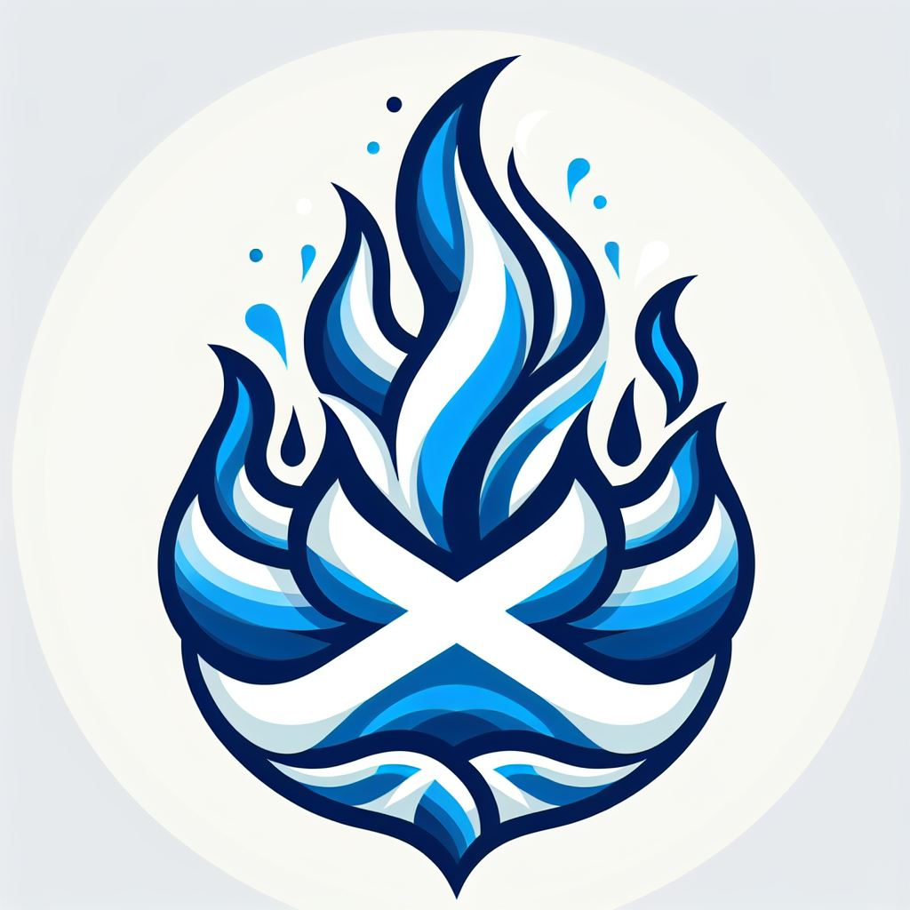

Ross Ferguson successfully applied to the UKGovCamp grant fund for their 19 June 2025 event in Edinburgh.

 A.I. generated Govcamp Scotland logo

 

#### [Grant fund](https://www.ukgovcamp.com/grants/) application:

 

**Name**: Ross Ferguson.

**Your email**: [ross.ferguson@public.digital](mailto:ross.ferguson@public.digital)

**Event**: [Govcamp Scotland 2025](https://www.govcamp.scot/)

**Description**: GovCamp Scotland is an unconference for people who want to put their collective energy into making public services in Scotland the best they can be.

Date = 19 June 2025. Location = Edinburgh Futures Institute, University of Edinburgh.

The goals in 2025 are to be:

- An inclusive, pacey, upbeat event
- That gets energy and positivity flowing in Scottish public service thinking and practice
- Appealing to Scotland’s public sector practitioners
- Providing a platform to share delivery stories and make connections that endure beyond the event
- Encouraging contributions from generalists and specialists, especially younger public servants
- Test out whether GovCamp Scotland could become a regular gathering

The GovCamp events use an unconference format, where the attendees lead the agenda of the day.

GovCamp Scotland will be an event that is nonpartisan, free of any sales agenda, and low bureaucracy to organise and attend.

The emphasis is on learning, sharing and making connections to support public service delivery, professional development and active communities of practice.

Website = [https://www.govcamp.scot/](https://www.govcamp.scot/)

**Amount requested**: £750.

**What the funding will be used for**: We would utilise the funding toward general expenses anticipated to run the unconference, primarily software service licenses used to organise the event, refreshments during the event, and social venue hire.

However, we also think that travel bursaries will be appeal to attendees travelling from rural and long distance locations in Scotland to the event in Edinburgh. We understand that many Scottish government organisations have removed travel expenses for employee travel. We heard from organisers of GovCamp Cymru that they had success with a similar bursary.

The association and alignment with the main UK Govcamp event and organising group is also an important consideration behind our application.

**About you, what you do, and your interest in running this event**: I know first-hand how valuable and motivating the Govcamp events can be, having attended early UK Govcamps. I noticed a lack of a similar event in Scotland and I strongly feel that running such an event could bring vital energy and sense of togetherness amongst the community of practice that is here in Scotland but has too few opportunities to get together unless there is an agenda, a panel, and a hall of vendor stands.

I've organised a group of like-minded organisers in Research Data Scotland, National Library of Scotland and NHS Education for Scotland. We are all based in Scotland. I myself work for Public Digital, who are letting me contribute time and will provide some sponsorship (as they have done for the recent UK Govcamp and GovCamp Cymru events).

 

#### Feedback from [UK Gov Camp Slack](https://join.slack.com/t/ukgovcamp/shared_invite/zt-30z3ah4o2-QFW9vHJ69w94ywglIYPXZw) members:

Once an application is received, it's posted in the [#grant-fund channel](https://ukgovcamp.slack.com/archives/C087MH5D84X) for members to discuss and vote on.

The application was [posted in Slack on Thursday 27 February 2025](https://ukgovcamp.slack.com/archives/C087MH5D84X/p1740670755565709).

It received 11 👍 approvals and 0 👎 rejections.
