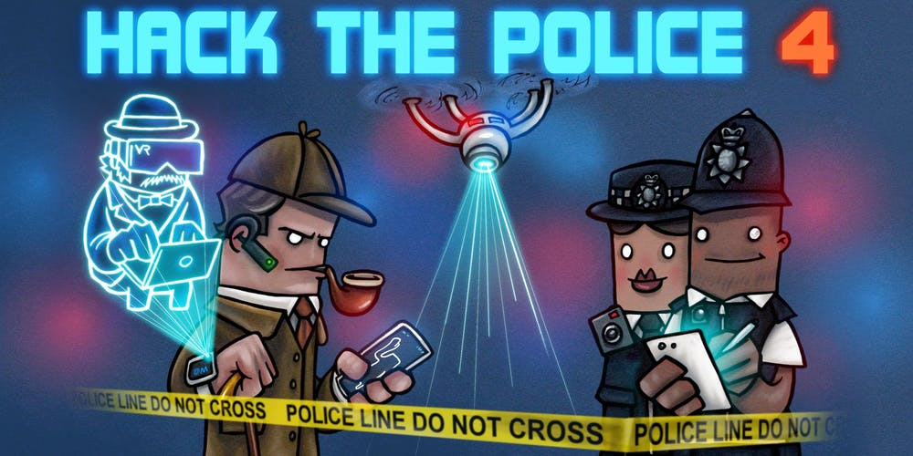

Hack the Police have successfully applied to the UKGovCamp grant fund and will receive £300. Below is their application:

**Name of applicant:** Lewis Westbury

**Description of the event:** Hack the Police is a civic tech hackathon based around solving problems in policing, public safety and crime. This year, our theme is investigation - from crime scene to case file.

The event follows the format of a classic hackathon - over the weekend of 14-15 September, teams will compete for prizes in a number of categories (to be announced closer to the event). We're collating data sources that teams can use, and looking for practical applications of technology to help make people's lives safer and improve the process for investigators, victims and witnesses.

We're inviting developers, designers, data scientists, students, academics, criminologists and crime scientists to join us and work alongside serving detectives, police officers and crime scene investigators.

We're on twitter as @hackthepolice, and you can find out lots more about the event at: hackthepolice.com

**How much funding are you looking for?** £300

**What do you expect the funding will be used for?** Our venue has been donated, so we're now developing a budget to cover the other costs of the hackathon. Hack the Police is a free event, and we estimate that our budget for food will be in the region of £600 (estimating 30 participants, 4 meals each at £5 per head). A £300 grant would go a long way towards assuring that.

**Finally, please tell us a bit about yourself, what you do, and your interest in running this event:**I've been a volunteer police constable with the Metropolitan Police since 2009, and I'm on a career break now to be able to spend my time developing Police Rewired.

Police Rewired is an entirely voluntary group. We run a number of free events throughout the year, in collaboration with other police forces and organisations, and Hack the Police is our annual hackathon.

I've been a developer all my life, and I'm a passionate technologist. Through Police Rewired I'm combining my passion for policing and public safety with my love of building and making.

Reaching out into the civic tech community is really important to be able to share the problems that I see every day in policing with people who have great new ideas about how to fix them; and at the same time to communicate the idea that policing is an area of government that civic technologists can get involved in. We can apply the same techniques from working with government to improve the UX of victims, witnesses and police officers.

Policing technology is a ripe field for modernisation, and I hope Police Rewired can play a small part in nudging it towards open standards and open source development as it does so.
