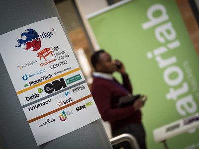

Now is a great time to set some budget aside.

We’ll be starting to plan for the next event towards the start of the summer, so we don’t know whether it’ll be just online again or in person as well but we do know we’ll be working hard to make it the same awesome community event that it always is!

Sponsors are key to delivering a great annual event and seed funding many other [similar events](https://www.ukgovcamp.com/category/support-events/) during the year.

We have a number of sponsorship levels:

Bronze <£250

Silver £250 to £499

Gold £500 to £999

Platinum >£999

If you’re interested in hearing more, email [sponsors@ukgovcamp.com](mailto:sponsors@ukgovcamp.com) or head to the website for more details [www.ukgovcamp.com/become-a-sponsor](http://www.ukgovcamp.com/become-a-sponsor)
