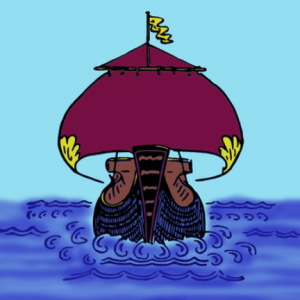

 Library Data Camp logo

**Description of the event:** [Library data camp](https://www.eventbrite.co.uk/e/voyage-of-the-data-treader-2-put-your-library-on-the-map-registration-54560488891) is dedicated to exploring data and open data in libraries through a mix of workshops, discussions, and data playing.

Part of the day will be an unconference and we'll be inviting attendees to pitch topics. We're also be looking at using Wikidata for the publishing and reuse of library data. [Jason Evans](https://twitter.com/WIKI_NLW), Wikimedian in Residence at the National Library of Wales, who will be running a training session in using Wikidata, and sharing his experience working on the [Libraries in Wales data project](https://www.cilip.org.uk/members/group_content_view.asp?group=200145&id=733577).

Anyone interested in using data to improve library services is welcome.

[Library Data Camp](https://www.eventbrite.co.uk/e/voyage-of-the-data-treader-2-put-your-library-on-the-map-registration-54560488891) takes place at Manchester Central Library on Monday 11 March 2019.

**How much funding:** £200

**What the funding will be used for:** The money will be used for materials including flyer handouts and stationery. We would like to print postcards which include an easy guide for adding to and editing Wikidata which can be distributed on the day, but also to help the instructions to reach those not attending.

**Tell us a bit about yourself:** \[[Claire Back](https://twitter.com/calire) is\] a Development Manager with Plymouth Libraries. \[Their\] role covers digital, marketing and communications. \[They're\] interested in open data and how it can be used to improve library services, but also in making sure that library staff have the skills and knowledge to work with data and to provide opportunities for this knowledge to be shared.
