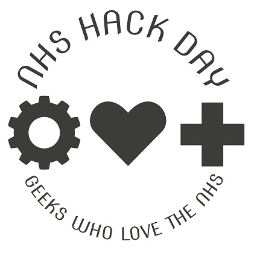

 NHS Hack Day

**Description of the event:** [NHS Hack Day](https://nhshackday.com/) is a 2-day weekend hack event for geeks who love the the NHS, with the aim of "Making NHS IT less bad"

NHS Hack Day attracts a broad range of attendees and works best when we have a mixture of clinical / frontline NHS staff, and developers / technologists both from within and from outside the health sector.

We run the event as a 2-day hackathon; it is free for attendees, and we provide lunch on both days.

You can view some of the previous outputs from previous events on the website [http://nhshackday.com/](http://nhshackday.com/)

**How much funding:** £500

**Funding will be used for:** We cover the majority of funding through sponsorship however there is always a need to seed the event at the start whilst we're generating interest. The grant would be put towards securing the venue, catering, and other items which require early booking.

**About the applicant:** \[[Matthew Stibbs](https://twitter.com/MattStibbs) is\] a product person currently working for NHS Digital solving problems for the urgent & emergency sector either by using tech, or by stopping people from using tech! I've been a regular NHS Hack Day attendee, and have helped run some more recent events. I am on the organising team for NHSHD #21. NHS Hack Day is genuinely a breath of fresh air, and I never cease to be amazed at what a team of random techies and clinicians can produce in 1.5 days over a weekend (I'm talking full A&E predictive models using machine learning and other clever data stuff).
