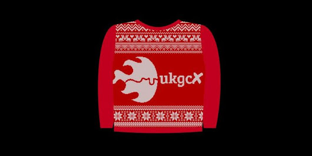

Why there won’t be any conference swag at this year’s UKGovCamp

Each year when we plan UKGovCamp, we think again about how we do it and how we can make the next UKGovCamp even better than the last.

This year, amongst other things, we’ve been thinking about conference swag - branded things like t-shirts and mugs that people can take away with them.

We asked people when they were applying for tickets to tell us what swag they would like, and got some useful feedback about people’s preferences (water bottles and t-shirts were the most popular things). But we didn’t ask the question about whether there should be any swag at all.

 

## Asking the question we should have asked

We’ve since had some conversations [with our community on Twitter](https://twitter.com/JanetHughes/status/1062419870074187776), and (as well as making it clear that some people really like UKGovCamp t-shirts and find them useful) that’s made us think more fundamentally about why we provide conference swag at all, and whether it’s really something we should continue to do. Thank you to everyone who contributed to the conversation and helped us think this through.

## So what now?

So we’ve decided that this year we’re going to try a different approach. Instead of encouraging our sponsors to pay for a specific piece of swag for people to take home with them, we’re now planning to invite them to sponsor 2 new things:

1. A creche, so that people can bring their kids along and have them taken care of throughout the day
2. A bursary for people who would otherwise not be able to come because of the cost of travel, or other costs such as those associated with caring responsibilities

We’ll confirm both of these things here, as soon as we possibly can so that anyone who wants to use these options can plan accordingly.

Sponsors can also choose to sponsor lunch or evening drinks and food before and after the event.

We realise we’re now only a couple of months away from the event, and we’ve already run the ticket lottery: there may be people who would have applied for tickets if they had known we were going to provide these things. We’re sorry if that’s you, and you’ve missed out on a ticket this time. But we think it’s still worth giving these 2 things a try to see if anyone who did apply for a ticket could benefit. Depending on how it works out, we’ll think about putting it in place from the start of the process next year.

Because we’re not going to be providing sponsored / branded mugs or water bottles, we’ll be encouraging everyone to bring their own water bottles and re-usable cups.

## Swag

If sponsors want to bring their own branded swag, they of course still can, but we won’t be offering any co-branding opportunities for swag this year. We’re also thinking about other ways to let everyone know who has made the event possible through their generous sponsorship.

There will still be stickers. We can’t quite bring ourselves to give up the stickers.

## Applying for a bursary

We’re now looking into how best to do the bursary and the creche. We’ve already had some really helpful suggestions from others who have run similar things for their conferences. **To apply for a bursary you can do so here:** **[UKGovCamp Bursary Application](https://docs.google.com/forms/d/e/1FAIpQLSeA7ofkNO8p-EV-OWlScpeFINjooCX7S_oRP9empnKvGTuBew/viewform)**

And if you really want a t-shirt, we’ll be making some for our campmakers so that they can be easily recognised on the day. So, volunteer to help and a special rare-edition campmaker t-shirt will be yours for the taking.
