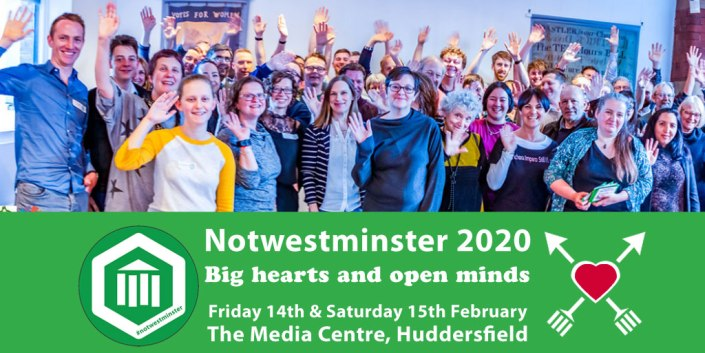

Notwestminster 2020 have successfully applied to the UKGovCamp grant fund and will receive £500. Below is their application:

**Name of applicant:** Diane Sims

**Description of the event:** Notwestminster is a free event for everyone who has something positive to say about local democracy and anyone who is up for the challenge of making it better. Our 2020 event includes two days of participant-led workshops, conversations, quick-fire talks, practical collaboration and inspiration at the Media Centre in Huddersfield on Friday 14th and Saturday 15th February 2020.

Local government officers, digital makers, open data champions, active citizens, councillors, academics, democratic organisations and young people all participate in Notwestminster. It’s this mix of people, all with enthusiasm for finding practical ways to improve our local democracy, that makes it a unique, productive and inspiring event.

You can find out more at: [https://notinwestminster.wordpress.com/notwestminster-2020/](https://notinwestminster.wordpress.com/notwestminster-2020/)

**How much funding are you looking for?** £500

**What do you expect the funding will be used for?** We would put some of the funding towards providing food and refreshments for our participants (at least 80 on the Saturday, and up to 50 on the Friday). We would then like to be able to support a creative activity that’s in keeping with this year’s theme, so that we can offer different ways for citizens to get involved and different ways of sharing our learning. We may also need to cover the travel costs of some community participants.

**Finally, please tell us a bit about yourself, what you do, and your interest in running this event:** I’m a community activist, digital practitioner and local democracy advocate. My kind of democracy is the democracy that we live and breathe, each and every day. It’s about being able to get things done where you live, having a voice, and being connected. It’s a human-scale local democracy, based on personal relationships, which only grows when we have our hearts in it. I think we can only improve our local democracy by listening to each other, having open minds, being kind to each other and being willing to take personal responsibility for making things better.

Although I co-ordinate Notwestminster as a volunteer, it’s closely linked with my professional work. My role as part of the Democracy Service at Kirklees Council involves working with our citizens and partners to grow a stronger local democracy, with a particular focus on citizen engagement, openness and digital networks.

I’ve recently helped to support a group of young commissioners to hear from over 1,700 children and young people in Kirklees and create a report based on this learning, to guide the future of our youth council. I’ve set up a Democracy Seekers network to enable local citizens to have direct input into practical tasks to strengthen our local democracy. I’m leading a project to support our councillors and citizens in developing digital skills and confidence for civic good, and I’ve helped to develop our ground-up approach to citizen engagement in Kirklees, which focuses on the strong local identity of our neighbourhoods, villages and towns.

Notwestminster has become a welcoming community in which we can work together, share experiences and do something positive for local democracy in all of our places. I think it’s a valuable antidote to some of the things that are happening in our democracy today. I don’t want to be down-hearted about our democracy, because I know that we have the hearts and minds to change it.
