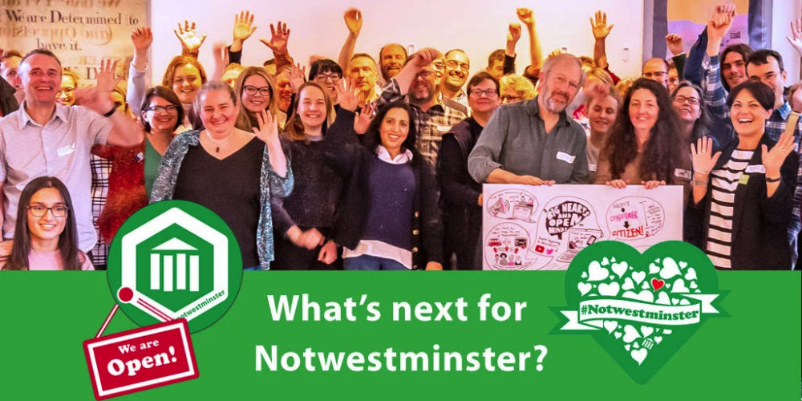

NotWestminster have successfully applied to the UKGovcamp grant fund and will receive £1000. Below is their application:

**Name of applicant: Diane Sims**

**Description of the event:** NotWestminster is a free event for everyone who has something positive to say about local democracy and anyone who is up for the challenge of making it better. We usually host an annual two day event each February in Huddersfield, featuring participant-led workshops, conversations, quick-fire talks, practical collaboration and inspiration. For 2022 we plan hold our main event in person on a Saturday, plus we will host a new online event to support members of our network with connecting and collaborating. Local government officers, digital makers, open data champions, active citizens, councillors, academics, democratic organisations and young people all participate in NotWestminster. It’s this mix of people, all with enthusiasm for finding practical ways to improve our local democracy, that makes NotWestminster unique, productive and inspiring. You can find out more about us at: [http://www.notwestminster.org.uk](http://www.notwestminster.org.uk)

**How much funding are you looking for?** £1000

**What do you expect the funding will be used for?**

We would use the funding towards providing food and refreshments for our participants. It’s important that we can keep the event free so that everyone who wants to can participate. The grant would also help us to better support our online event. Additional info: We usually partner with the Media Centre in Huddersfield for our events but they are unable to support us in 2022 due to the impact of Covid on their business (meaning that key spaces have currently been repurposed, along with some other significant challenges). We’re currently trying to secure a new venue for 2022 and our event costs may potentially double. If there’s any possibility of a larger grant this year, that would make a huge difference to us (but we understand if this isn’t an option). Thank you very much.

**Finally, please tell us a bit about yourself, what you do, and your interest in running this event:** I’m a local democracy advocate, community activist and digital practitioner. I have a strong interest in everyday democracy and I look for ways to enable people to get things done where they live and to have a voice in their local place. A big part of this is about being connected to others who can help. I believe in a local democracy that’s based on personal relationships, which only grows when we have our hearts in it. Notwestminster has become a welcoming community in which we can work together, share experiences and do something positive for local democracy in all of our places. Like many people and organisations, it’s fair to say that we are going through some changes. But we are still here to support each other and we’re keen to give our participants opportunities to meet again. Although I co-ordinate Notwestminster as a volunteer, it’s closely linked with my professional work. My role as part of the Democracy team at Kirklees Council involves working with our citizens and partners to grow a stronger local democracy, with a particular focus on citizen engagement, openness, networks and local identity. As part of our commitment to active citizenship, we have recently worked with over 100 citizens to create Shaped by People, which is a new shared strategic outcome for Kirklees, written by local people in their own words. This shared goal describes the future that citizens want to see, where more people are able to sharpe their local place for the better. This is the kind of local democracy which NotWestminster enables - a democracy in which we can all play an active part, everyday.
