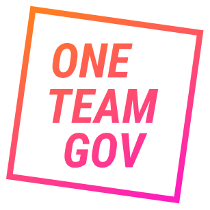

 OneTeamGov logo

**Description of the event:** One Team Gov are running Wellbeing Camp to talk more about wellbeing and inclusion. The event will look in more detail at inclusion and the impact this can have on our wellbeing. We want to increase awareness and understanding about inclusion, mindfulness, neurodiversity and mental health, we want to help people manage their own wellbeing and that of their teams in an environment of constant societal and technological change.

**How much funding are you looking for?** £500

**What do you expect the funding will be used for?** Facilitators delivering sessions to public servants on how to take care of their wellbeing, to help them know more about how we create an inclusive culture, and how to take care of each other.

**Tell us a bit about yourself, what you do, and your interest in running this event:** I'm Nour Sidawi, part of the organising team, and core team at One Team Gov.
