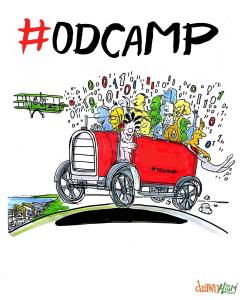

Open Data Camp have successfully applied to the UKGovCamp grant fund and will receive £500. Below is their application:

**Name of applicant:** Giuseppe Sollazzo

**Description of the event:** Open Data Camp is a two-day, weekend event, entirely devoted to Open Data. It loosely follows the ‘Unconference‘ format, and is inspired to similar events like UKGovCamp and BlueLightCamp. It is at its 7th event, which is the first time the event is run in London after 6 previous editions in Winchester, Manchester, Bristol, Cardiff, Belfast, and Aberdeen.

**How much funding are you looking for?** £500

**What do you expect the funding will be used for?** Covering venue costs, catering, and hopefully (having enough sponsorship beyond this grant) childcare costs

**Finally, please tell us a bit about yourself, what you do, and your interest in running this event:** I'm one of the Open Data Camp co-founders, I'm currently a civil servant at DfT working as head of data, and I have an interest in making sure that the community that coalesced around data and transparency isn't lost
