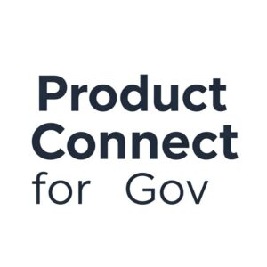

Debbie Blanchard has successfully applied to the UKGovCamp grant fund for their event.

 Product Connect for Gov

[Grant fund](https://www.ukgovcamp.com/grants/) application: 

**Name**: Debbie Blanchard.

**Your email**: [debbieblanchard44@gmail.com](mailto:debbieblanchard44@gmail.com)

**Event**: Product Connect for Gov.

**Description**: We want to put on a product conference (shape to be confirmed - but mixed streams of speaker, L&D and lightning talks) for 450 gov/gov adjacent product people. We aim to offer this in Leeds or Birmingham #NotJustLondon - we want to do something akin to DeliverCon, and meet the outstanding need for a large scale product meet up cross gov.

Website = To be confirmed, but check [Product for the People](https://productforthepeople.xyz/) in the mean time.

**Amount requested**: £750.

**What the funding will be used for**: Venue hire/refreshments/general supplies. We have no budget for this event and so are seeking sponsorship to cover costs.

**About you, what you do, and your interest in running this event**: I'm Deb, Head of Profession for Product at [DfE](http://gov.uk/dfe). I'm arranging this with [DWP](http://gov.uk/dwp) and [DBT](http://gov.uk/dbt). I have just led work to refresh the capability framework for product and am trying to do more for the cross govt community in addition to my day role. We have a lot of feedback that people want to do more to engage with their community, and this is (another) way in which I want to support that.

 

#### Feedback from [UK Gov Camp Slack](https://join.slack.com/t/ukgovcamp/shared_invite/zt-30z3ah4o2-QFW9vHJ69w94ywglIYPXZw) members:

Once an application is received, it's posted in the [#grant-fund channel](https://ukgovcamp.slack.com/archives/C087MH5D84X) for members to discuss and vote on.

The application was [posted in Slack on 24 March 2025](https://ukgovcamp.slack.com/archives/C087MH5D84X/p1742852094604529).

It received 7 👍 approvals and 1 👎 rejections.
