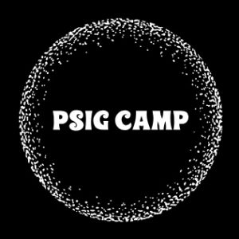

 Temporary PSIG Camp logo

**Description of the event:** An event to gather together people working in improving services in the public sector

**How much funding:** £500

**The funding will be used for:** To help us start to generate interest in the event and look at venues. The event will be free to attendees from the Public Sector and funded by sponsorship. We will cover improvement topics like lean, agile, design thinking, lean start up and will be half conference half unconference

**A bit about yourself:** \[[Andrew Sandford](https://twitter.com/Leanandagile) has\] worked in improvement in the public sector for nearly 20 years. I want to create a community to learn share and improve the way we deliver service improvements
