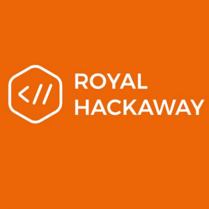

 Royal hackaway

**Description of the event:** [Royal Hackaway](https://royalhackaway.com/hackaway2019) is a 24 hour student run hackathon and invention marathon. An [Major League Hacking](https://mlh.io/) (MLH) 2019 Season Event, we're hosting 200 students at Royal Holloway's campus over the weekend to learn new skills and technologies, build exciting projects and share in an awesome experience. At the end of the event we'll be judging the teams for the main prize and any sponsor challenges - we'd love to offer UKGovCamp the opportunity to set a challenge and come along to judge it!

**How much funding?** £500

**What will it be used for?** Essentially running the event - our catering costs are around £2.6k this year, for scale!

**Details of the applicant:** \[[Hugh Wells](https://twitter.com/CrabLabuk) is\] a student at Royal Holloway and a passionate advocate for Open Government, doing digital properly and Open Source Software. I've been attending hackathons for around decade and last year we ran RoyalHackaway as the first hackathon ever at Royal Holloway. In continuing to give back to the community that gave me so many of the skills I have now, I'm helping to lead the efforts again this year which will see us roughly double in size!
