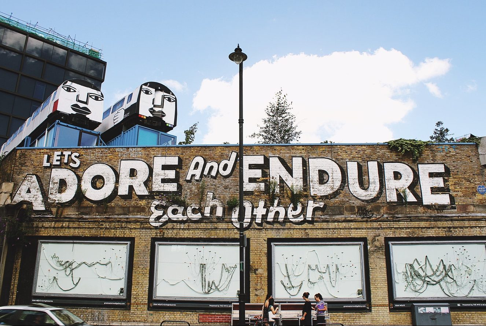
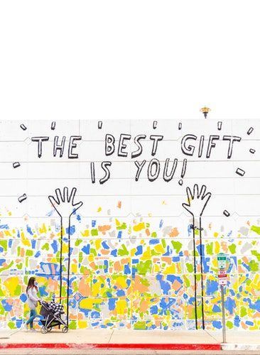

## Supporting you at UKGovcamp 2018

Whether you’re an introvert, extrovert or ambivert, shy, confident or somewhere in between, enjoy networking or prefer to sit in the corner looking at your phone during the coffee breaks, there’s always a spectrum of personalities at events.

We always want GovCamp to be an inclusive, supportive environment where you can meet new people, pitch ideas, catch up with old friends, learn from peers, and come away with experiences you want to share and ideas you want to try out. It’s your open space.

With GovCamp fast approaching (this Saturday!) we’ve come up with these tips to create a happy space where folks don’t feel overwhelmed and have a great experience. These are probably going to seem obvious, which is great because they should be!

But first, if you’ve never attended GovCamp or an unconference before, we recommend reading our [logistics blog post](https://www.ukgovcamp.com/2018/01/16/ukgovcamp-2018/) and watching this video of [GovCamp 2014 to see what you can expect for the day.](https://www.ukgovcamp.com/about/)

 

* * *

## Tips to help make sure everyone has a good time

 

1. **Always bring your whole self to GovCamp.** We value your attendance. We take pride in being open, inclusive, supportive space where everyone’s voice is equal. This is our [code of conduct](https://www.ukgovcamp.com/code-of-conduct/). Here are [photos of GovCamp organisers](https://www.ukgovcamp.com/about/). We also have Campmakers (volunteers who help us run the event on the day). **Organisers and Campmakers will be wearing grey t-shirts so that you can identify us more easily.** We haven’t received any requests for special assistance this year, if you need help then please mention when you arrive to collect your ticket.
2. [**Everyone has a pitch inside of them**](https://www.youtube.com/watch?v=q97qHoHN1RI).Being nervous about pitching is completely normal. Pitching is at the start of the day, and it can be noisy with high levels of energy as everyone starts to settle in. We will have Campmakers near the queues to help you, if you just want to talk you idea through with someone. If you don’t want to get up and pitch, someone will be happy to do it for you or if you want to [bring a friend on the stage](https://twitter.com/KathrynPerera/status/921300046079037440) then go for it!
3. We will have a **dedicated quiet room** (Room 6), with a dedicated Campmaker for each session and guidelines for the room so that it is respected.  Why not write down ideas on post-it notes and stick them to the walls so that others can contribute throughout the day?
4. **Please raise your hand to speak in a session.** We’ve all been in situations where a few voices dominate a conversation, we’ve all attended an event where someone has a question that runs a bit long. It’s easily done without realising - especially when someone is passionate about an issue - but it’s frustrating and its not inclusive.
5. **If you’re running a session**, please do your best to make sure everyone has the opportunity to speak, but don’t pick on people to contribute. You might want to start your session by reminding attendees of the topic, and giving 5 minutes for them to write down any ideas they’d like to discuss, before launching into conversations. It’s helpful 5-10 minutes towards the end, to ask if anyone who hasn’t made a point and would like to could raise their hand to do so in the final minutes of the session. Do remind people that all session notes are open, and we welcome additions and ideas to those topics after the day is done.
6. **Play where you play best**. If you’re in a session and find its not for you, then move to where you can make a difference. No one will be offended if you do.
7. **Follow the conversation on Twitter using** [**#UKGC18**](https://twitter.com/search?q=ukgc18)**.** Why not use the hashtag to [discuss session ideas you’d like to pitch,](https://twitter.com/Adewunmi/status/952961167307235333) or share what people can talk to you about?
8. We respect that **some attendees may not want to be photographed** at GovCamp. If that’s you, please **pick an orange lanyard** and our Campmakers on photography duty will try their very best not to capture you. Our official photographers are [@davidtheep](https://twitter.com/davidthep) [@ashroplad](https://twitter.com/@ashroplad), if they’ve inadvertently captured you in a picture just let them know and they’ll take it down.
9. People love to read about attendees experiences and key takeaways, so please do **share your reflections of the day.** Here are some examples of blog posts from previous years: [GovCampCymru 2017](https://www.linkedin.com/pulse/conferencing-unconferencing-sara-long/), [UKGovCamp 2014](http://www.computerweekly.com/opinion/UKGovCamp-2014-discussions-on-delivering-digital-government), [UKGovCamp 2012](https://danslee.wordpress.com/2012/01/21/glasto-for-geeks-bullet-points-from-uk-govcamp-2012/), [UKGovCamp 2017](https://blog.weareconvivio.com/previously-at-ukgovcamp-6ede19e37d1a).
10. Above all, at any point in the day if you have questions, concerns or feedback then please speak to Organisers and Campmakers. **We want you to have a great experience.**

* * *

## Other Suggestions

Here’s the suggestions we received via Twitter from [@MelRayment](https://twitter.com/MelRayment), [@JonMartlew,](https://twitter.com/jmartlew) [@SallyLait](https://twitter.com/sallylait) and [@KatieAtwood.](https://twitter.com/katie_attwood) We’ve included as many of these great ideas as we can for this year.

- Provide other ways of voicing opinion, ways for reflective conversations and different devices for challenging ideas over loudest voice in room.
- It's noisy, busy and friendly when everyone arrives and the invite to pitch starts. A quiet room before this with people to help others know what to expect and encourage them to pitch may be helpful.
- Set out tables where people (particularly those attending alone) are encouraged to sit and chat.  Lunchtimes can be tricky for people attending alone or aren't comfortable just plonking themselves next to a stranger.

- Session hosts or support from volunteers can help ensure a couple of people don't monopolise conversations. Some sessions could start with 5 mins sharing post-it thoughts and session hosts draw out themes that way?
- Poster sessions are great to wander round, reflect on what you see, connect different ideas and approach presenters in your own time.
- Start conversations beforehand online and curate themes on topics like a pre-discovery phase. Or facilitate two half sessions beginning and end of event.
- Using more purposeful design facilitation in event, so that competitive style brainstorming doesn't occur.
- Do activities that involve articulating views not by voice. Drawing, voting, interactive (low-fi) walls for opinions/ideas throughout event, such as big questions on paper left in public spaces. Use this interaction to feedback to groups, etc.
- Theme conversation tables
- Talk to me about X (badges)
- Whispering walls (blind conversations - discussing a question or topic)

 

- Blog post by [Amanda Smith](https://twitter.com/ayymanduh)

SaveSave

SaveSave
