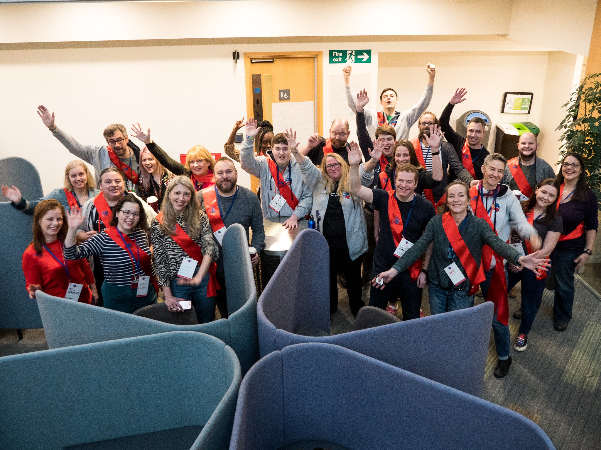

\_\_\_\_\_\_\_\_\_\_\_\_\_\_\_\_\_\_\_\_\_\_\_\_\_\_\_\_\_\_\_\_\_\_\_\_\_\_\_\_\_\_\_\_\_\_\_\_\_\_\_\_\_\_\_\_\_\_\_\_\_\_\_\_\_\_\_\_\_\_\_\_\_

**TL;DR:** GovCamp is back! We’ve opened the lottery, so apply for your ticket now. You can also apply for **creche** places and **bursaries**. And we are looking for lovely **sponsors**!

\_\_\_\_\_\_\_\_\_\_\_\_\_\_\_\_\_\_\_\_\_\_\_\_\_\_\_\_\_\_\_\_\_\_\_\_\_\_\_\_\_\_\_\_\_\_\_\_\_\_\_\_\_\_\_\_\_\_\_\_\_\_\_\_\_\_\_\_\_\_\_\_\_

 

With less than six months to go, we’re kicking off the preparations for GovCamp 2020 (#ukgc20). From now until Monday 4th November, you have the opportunity to take part in the ticket lottery and get 1 of the 200 tickets available.

# You can **[apply to the Ticket lottery here.](https://docs.google.com/forms/d/e/1FAIpQLSdWeC1bbgnpBmOMicxIVM3ciUfUB7m0xlRMB6yRBUyu3MyNtg/viewform)**

 

## **What is GovCamp?**

GovCamp is an unconference - an event with no agenda - where attendees shape the day. You can see what’s been discussed at past GovCamps [here](https://docs.google.com/spreadsheets/d/1S6nemSPxSLrURGigaQZFKViWBoAhalpE2f0RtZ92Fpk/edit#gid=11), and the following blog posts should give you an idea of what to expect.

- From [Steve Parks at Convivio](https://blog.weareconvivio.com/what-to-expect-at-ukgovcamp-ecc37191dc81) 
- From [Lucy Knight](https://geekwonkinterface.wordpress.com/2016/06/14/its-ok/)
- From [Debbie Blanchard](https://dwpdigital.blog.gov.uk/2018/02/19/sharing-what-i-learnt-at-ukgovcamp/)
- From [Dan Barrett](https://medium.com/@dasbarrett/uk-govcamp-2019-reflections-c2eb14c782a2)
- From [Sam Villis](https://medium.com/@stamanfar/notes-from-govcamp-ukgc19-37dbb84de739)

 UKGovcamp 2019, photo credit Nigel Bishop

You can see more of Nigel's UKGovcamp 2019 photos [here](https://www.flickr.com/photos/wnbishop/albums/72157705985906571).

 

## **Things to know about the lottery**

- We aim to **create a diverse and inclusive environment**, and to help us do this we are **collecting some diversity data**. This data is intended to give us a picture of our strengths, and identify areas where we can improve.
- We take an **even handed approach to gender identity ticketing** and to help us do that we have made this question mandatory (though you can choose not to say).
- We will **select 200 people at random** and ask you to claim your ticket if you’ve been successful. Unclaimed tickets will be reassigned.

 

## **We want to design and deliver the most inclusive event we can:**

- We ([the GovCamp organisers](https://www.ukgovcamp.com/about/)) are nine people who volunteer our spare time to put on GovCamp. Every year we are incredibly grateful to the generous sponsors that help us put on this event and provide some of the services/facilities. 
- In 2019, **we provided a creche and bursaries for the first time** to as many people as possible to attend. We’re delighted to provide these again. 
- As part of the ticket lottery you’ll be asked if you’d like to apply for the creche and/or for a bursary.  If you get allocated a ticket, then we’ll be in touch with further details. Please note that these are first come, first served. We don’t have an unlimited pot of funding for these. 

 

## **A reminder for you**

- We don’t do swag anymore, with the exception of stickers because [they have value and can be useful](https://gilest.org/stickers.html). So **bring your stickers for our sticker swap table.** We’re also bringing back our **book swap**, so **bring any books you’d like someone else to have.** More details to follow in our logistics blog post closer to the date.

 

## **Sponsors, Sponsors, Sponsors!**

- [Become a sponsor!](https://www.ukgovcamp.com/become-a-sponsor/) 
    - We have options starting from £250 and platinum sponsors can sponsor one of the specific components of GovCamp (pre/post drinks, creche, bursaries, coffee, etc). You can fill in the form at the bottom of the [sponsors page](https://www.ukgovcamp.com/become-a-sponsor/) and we’ll get in touch.
    - Can’t afford to be a sponsor, but still want to make a small donation towards GovCamp costs? Now you can! Through paypal at: [www.paypal.com/pools/c/8btG3Cw8YF](http://www.paypal.com/pools/c/8btG3Cw8YF) 

 

## **How you can help us**

- Share information about GovCamp with your communities and organisations, and help us to reach people who haven’t been before by:
    - Sharing this post
    - Are you in any networks? Ping this post around the network.
    - Throw Govcamp into the conversation with friends and colleagues at work
    - Find someone who has never heard of Govcamp and tell them about it
