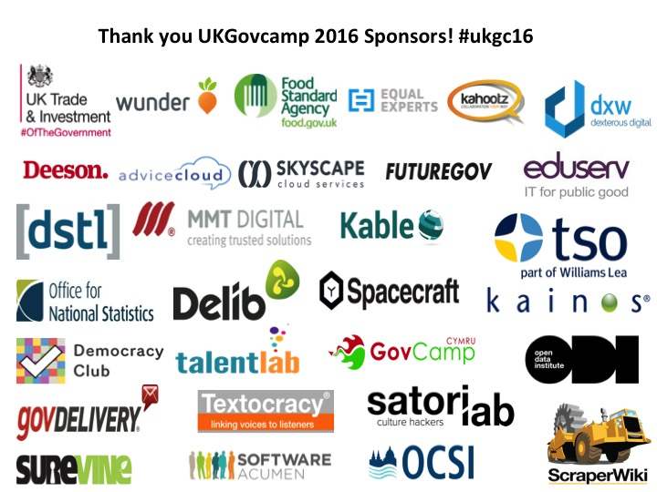
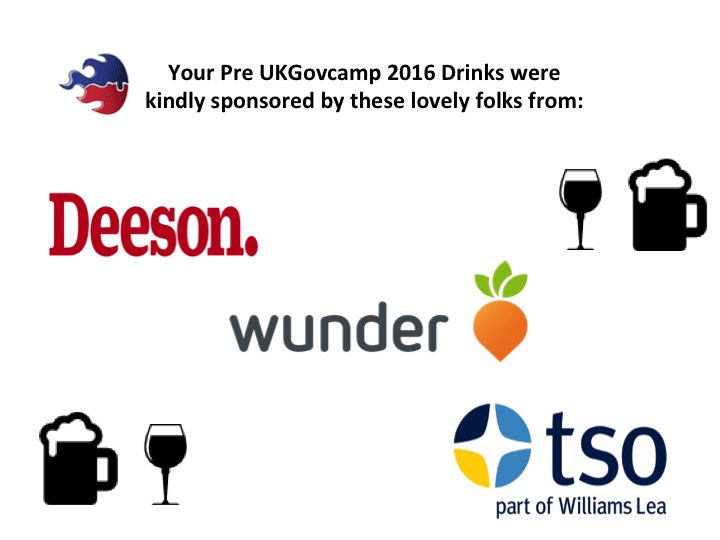
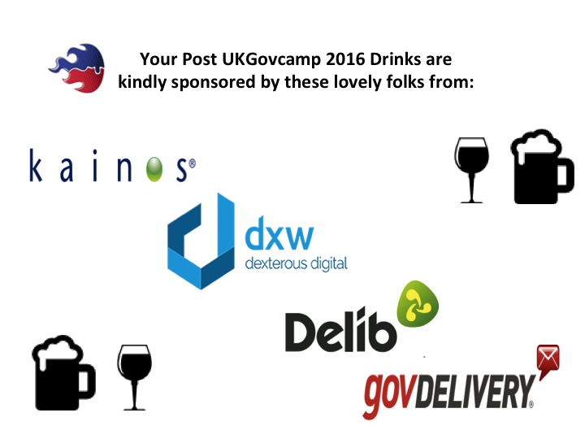

My, my. How time does indeed fly. In the blink of an eye we find ourselves with less than a week to go till #ukgc16 kicks off on Saturday the 23rd of January, hosted by the kind folks at the [National Audit Office](https://www.google.co.uk/maps/place/National+Audit+Office/@51.4916783,-0.1485413,15z/data=!4m2!3m1!1s0x0:0x5d8dbc0441be8df3).

 

**Thank you!**

We've had a great response from our call for Sponsorship, and we are truly humbled by the generosity of our many, many sponsors. Without sponsorship, UKGovcamp simply wouldn't happen. Any additional money that is raised, is ploughed back into your community to help fund other bar camps throughout the year to help our community grow.

 

We'd also like to give a shout out to our Pre & Post drinks Sponsors:

#ukgc16 drinks will be held in the [St George's Tavern](https://www.google.co.uk/maps/place/The+St.+Georges+Tavern/@51.4932418,-0.1468128,17z/data=!3m1!4b1!4m2!3m1!1s0x4876051f6978dc85:0x81c2462e0dfc7fcb) (a few minutes walk from the NAO) on Friday night from 6pm, for any #ukgc16 folk who are around in London, or perhaps travelling down to London to stay overnight. I'm sure there will be folk there till late, so do please pop in and perhaps start some of those #ukgc16 conversations early!

 

**On the day**

- Doors open: 9am
- Session pitches start: 10am

Please do make sure that you arrive no later than 9:30am as we've a lot to get through on the day and we will be starting at 10am sharp.

Camp makers will be onsite to help us keep everything run smoothly. There will be coffee and lunch provided, and we've even got #ukgc16 Bingo - who's going to manage to collect all the Sponsor stamps and be lucky in the draw?!

- Wrap up: 4:40pm
- Pub ([St Georges Tavern](https://www.google.co.uk/maps/place/The+St.+Georges+Tavern/@51.4932418,-0.1468128,17z/data=!3m1!4b1!4m2!3m1!1s0x4876051f6978dc85:0x81c2462e0dfc7fcb) again!): 5pm to continue on the conversation of #ukgc16 with drinks and nibbles

 

**Following the event**

We will be pulling together the schedule on the day after the session pitches and you can follow the session grids at:

- [Lynyrd](http://lanyrd.com/2016/ukgc16/) - you can view this online, or you can even download the App onto your phone
- [Google Docs](https://docs.google.com/spreadsheets/d/1S6nemSPxSLrURGigaQZFKViWBoAhalpE2f0RtZ92Fpk/edit#gid=11) - with Campmakers live blogging as many sessions as they can. Why don't you join in?

 

Please do check out our main social media channels:

- [Twitter](https://twitter.com/ukgovcamp) - follow us for announcements on the day
    - There's a handy [#ukgc16 Twitter list](https://twitter.com/UKGovCamp/lists/ukgc16) of all the folks who are attending and tweeting
    - Checkout the [#ukgc16 stream](https://twitter.com/search?q=%23ukgc16) which will have folks tweeting all throughout the day, evening and afterwards
    - For each session and room there will be a dedicated hashtag (to help sort out the information from all the wider ukgc16 noise). This works like this:
    - General = #ukgc16Session = #ukgc16 + s\_ + r\_s\_ = 1, 2, 3, 4 or 5
        
        r\_ = G1, G2, G3, G4, T1, T2, T3, T4, or RM
        
        eg Session 1, Room 1 = #ukgc16s1rg1
- [Facebook](https://www.facebook.com/ukgovcamp) - General info
- [Pinterest](https://uk.pinterest.com/ugovcamp/) - where we'll be collecting all the blog posts

 

Most of all, we hope you have fun on the day and enjoy the open space of #ukgc16 to get your conversations flowing.
