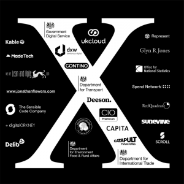

My, my. How time does indeed fly. In the blink of an eye we find ourselves with only days to go till #ukgcX kicks off on Saturday the 21st of January, hosted by the kind folks at the [National Audit Office](https://www.google.co.uk/maps/place/National+Audit+Office/@51.4916783,-0.1485413,15z/data=!4m2!3m1!1s0x0:0x5d8dbc0441be8df3).

 

# **Thank you!**

We’ve had a great response from our call for Sponsorship, and we are truly humbled by the generosity of our many, many sponsors. Without sponsorship, UKGovcamp simply wouldn’t happen. Any additional money that is raised, is ploughed back into your community to help fund other bar camps throughout the year to help your community grow.

 #ukgcX 2017 Sponsors

We’d also like to give a shout out to our Pre & Post drinks Sponsors who will keep you fed and watered in the evening:

 

 

 

The sponsors of the pop up coffee and the lovely lunch on the day:

 

And keeping  you hydrated with water bottles are:

## 

 

## **What do I do at Govcamp?**

A few folk who haven't been to UKGovcamp before have been asking what they need to do on the day. Have a read of these blog posts from previous Govcamps and fellow campers, which should give you an idea of what to expect. They capture it perfectly, better than I could.

- From [Stefan Czerniawski](http://publicstrategist.com/2015/01/camping-trip/)
- From [Lucy Knight](https://geekwonkinterface.wordpress.com/2016/06/14/its-ok/)

The day is for you.

It’s a unique experience, that you shape.

No two people have the same experience. You're already awesome just for being part of #ukgcX.

The best advice is to Listen, Speak, Engage and Enjoy!

If you wanted to know more about pitches and sessions on the day, check out our [recent blog post about what to expect and how to prepare](https://www.ukgovcamp.com/2017/01/15/pitch-and-run-at-ukgcx/)

 

## **LOGISTICS**

### **Friday Night**

pre-#ukgcX drinks will be held in the [St George’s Tavern](https://www.google.co.uk/maps/place/The+St.+Georges+Tavern/@51.4932418,-0.1468128,17z/data=!3m1!4b1!4m2!3m1!1s0x4876051f6978dc85:0x81c2462e0dfc7fcb) (a few minutes walk from the NAO) on Friday night from 6pm, for any #ukgcX folk who are around in London, or perhaps travelling down to London to stay overnight. I’m sure there will be folk there till late, so do please pop in and perhaps start some of those #ukgcX conversations early! We'll be in the back room of the pub and looking forward to meeting you.

 

### **Saturday - On the day**

- Doors open: 9am
- Session pitches start: 10am
- After the pitches are finished we'll update the [Session Grid](https://docs.google.com/spreadsheets/d/1S6nemSPxSLrURGigaQZFKViWBoAhalpE2f0RtZ92Fpk/pubhtml), with all the Talks, Room allocations and links to the live blogs.

**Please do make sure that you arrive no later than 9:30am as we’ve a lot to get through on the day and we will be starting at 9:45am sharp.**

Camp makers will be onsite to help us keep everything running smoothly (these folks rock!). There will be water, coffee and lunch provided. If you don't like whats on offer, there are plenty of eatery places around the National Audit Office if you wanted to pop out at lunchtime to grab something.

We'll be live blogging and tweeting, campers will be tweeting, taking pictures, taking video, live streaming as #ukgcX happens on and offline! We are also archiving your #ukgcX tweets that you can find here:

- [#ukgcX Tweets](https://docs.google.com/spreadsheets/d/1Oqf0z0O0GBLCmWx0JAQlRTcGjUmK_-rZsaBsyd00y_0/pubhtml?gid=2022233584&single=true) 
- [Session 1 Tweets](https://docs.google.com/spreadsheets/d/1sKvdIGL-0YA4ziNzClbWhShDeU3jf3rJLocYfDkWi_A/pubhtml?gid=1202082681&single=true)
- [Session 2 Tweets](https://docs.google.com/spreadsheets/d/1NynBSMz2iSxnM-VMJxD-a9YNAtihtdxnCYdLFGjxvYk/pubhtml?gid=309151400&single=true)
- [Session 3 Tweets](https://docs.google.com/spreadsheets/d/1eafOdQbpyN12BjWPOA-YWaj4YiLzpCizVcwQjrfPS08/pubhtml?gid=1927147153&single=true)
- [Session 4 Tweets](https://docs.google.com/spreadsheets/d/1nuBb_nh76ReruF0V68kRB5GR2rYHOAagSl_BpVMl2a4/pubhtml?gid=1570166624&single=true)
- [Session 5 Tweets](https://docs.google.com/spreadsheets/d/13gNZpTEaDlmggPnGPWMQGkGEqPiJF1bRMNzlEXPm9lQ/pubhtml?gid=613936648&single=true)

There's also the [#ukgcX Twitter List](https://twitter.com/UKGovCamp/lists/ukgcx/members) for you to follow to make it easier to see who's tweeting about #ukgcX, and then we look to bring the day to a close, back to the Auditorium for:

- Wrap up: 4:40pm

 

### **Saturday - In the Evening**

- Pub ([St Georges Tavern](https://www.google.co.uk/maps/place/The+St.+Georges+Tavern/@51.4932418,-0.1468128,17z/data=!3m1!4b1!4m2!3m1!1s0x4876051f6978dc85:0x81c2462e0dfc7fcb) again!): 5pm to continue on the conversation of #ukgcX with drinks and food provided until the bar tab runs dry. We've got the downstairs and back room booked out. **Food and the bar tab will be in the downstairs bar.** 

 

### **Sunday and beyond**

Your brain will probably be buzzing after #ukgcX. Rest up. Take time out to pause and reflect on your experience, us organisers and campmakers will certainly need a wee rest afterwards, once we can get our brains to stop buzzing!

It would be great to hear back from you on what sparked your interest? What did you learn? Who did you meet? What did you want to do differently?  Please blog and tweet about #ukgcX. We'll be building up the [Pinterest board](https://uk.pinterest.com/ugovcamp/ukgovcamp-2017/) of all your posts to share with our community.
