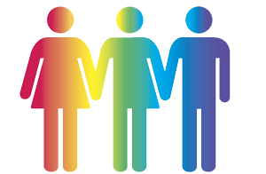

UKGovcamp is 10yrs old and back for 2017 at our old favourite venue - the [National Audit Office](http://www.nao.org.uk) It's a one-day Saturday event, and space is going to be tight.

 

**Gender Diversity**

Previous Govcamps have tended to have a gender diversity split of around 30% female, 70% Male. We've listened to your feedback about how important gender diversity is and this year we made a big push to try and close that gap. To make the event more gender neutral, asking our networks to reach out and encourage more women to apply to the lottery

We are proud to announce that after the random lottery ticket draw we have achieved a gender split of:

- 55% Female
- 43% Male
- 2%  Unknown

 

**Tickets**

We are **releasing tickets to the lucky lottery winners today** who will have **two weeks** to claim them. Those that won should be receiving an email from the UKGovcamp Eventbrite account today. Please check your inboxes and spam folders!

 

Any **unclaimed tickets** will be given to the next set of lottery winners etc etc until all tickets have been allocated.

 

Because of such high demand for tickets, this year we held a lottery to try and be as fair and impartial as possible. Nearly 600 people applied for just 200 places. In previous years we have had a high drop out rate on the day, which has denied a place that could have gone to someone else. We understand that life happens, so please let us know as much as you can in advance if your aren't going to make it. That way we can reallocate your ticket to the next person in line from the lottery.

If you don't cancel and don't turn up you'll be **added to our strike-out list which means tickets won't be available to you for the next event**.

 

**Getting involved**

Where can I follow what's going on, discuss ideas for sessions and so on?

- Ask questions or make suggestions on the [#ukgcX](https://twitter.com/search?q=%23ukgcx&src=typd) hashtag
- Follow our progress on [Trello](https://trello.com/b/Tn1kRS4X/ukgcx)
- Join the discussions in:
    - [Slack](http://slack.gov.camp)
    - [Facebook](https://www.facebook.com/ukgovcamp/)
    - [Twitter](http://twitter.com/UKGovCamp)

 

Look forward to seeing you at #ukgcX either in person or online!
