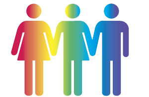

Now that autumn is here and the nights are drawing in, it's time to ramp up our efforts in getting UKGovcamp 2018 up and running.

Over the summer we've been running the Ticket lottery, a place for you to register your interest in wanting to attend next years UKGovcamp.  The lottery shut on the 31st of October.

 

## Why did we do a lottery?

Previous Govcamps have tended to have a gender diversity split of around 30% female, 70% Male.

We’ve listened to your feedback about how important gender and Black, Asian, Minority, Ethic (BAME) diversity is,  thus we have made a big push to try and narrow that gap. Reaching out across lots of different networks to encourage a more diverse range of people from all backgrounds to apply for a ticket.

People also fed back on how difficult it was to try and snag a ticket when they were released in batches as they went so fast, which wasn't fair to those who may have mobility or neurological impairments that meant they weren't as fast on the keyboard. Or because of carer commitments they weren't available at the release slot to try and grab a ticket.

A ticket lottery was deemed the fairest method of trying to achieve better ratios for BAME, Gender and to not exclude those on the neuro-diverse spectrum, or with carer responsibilities.

 

## Diversity

Last year was our first every ticket lottery and we have achieved a gender split in applicants of:

- 55% Female
- 43% Male
- 2%  Unknown

Which lead to an unconference speaker split of:

- 53% Male
- 47% Female

 

The most equal it had ever been in UKGovcamp history!

But in the spirit of Agile, we should look to iterate and improve up on this. We can do better and we'd like UKGovcamp to better represent the community it serves.

Last year there was a really great session on [BAME numbers in tech](https://docs.google.com/document/d/16U0M-uuasWHHeSieUt9vagdp-Oz2ursezjdxH_2IGR0), mindful of this we asked to collect BAME data at this years lottery to help us identify where we needed to improve on our BAME numbers.

## Analysis

525 people applied to the ticket lottery this year, and the community breaks down as (rounded to nearest %):

- **Gender Breakdown**

 
| Man | 50% |
| --- | --- |
| Woman | 46% |
| Prefer not to say | 3% |
| Non-binary / Genderqueer / Agender / Gender fluid | 1% |

That's an improvement on last years numbers in terms of equality.

- **Age Breakdown**
    
     
    | 16-24 years old | 6% |
    | --- | --- |
    | 25-34 years old | 42% |
    | 35-44 years old | 31% |
    | 45-54 years old | 16% |
    | 55-64 years old | 4% |
    | N/A | 1% |
    
    With the average age of a UK Civil Service being [over 40](https://www.statista.com/statistics/285138/uk-civil-service-employment-by-responsibility-level-and-age/), there's a definite departure of the traditional age profile. Is this because younger folk are more into unconferences and technology? Or because they feel more passionate about trying to change things for the better?

 

- **Ethnicity**

 
| British | 41% |
| --- | --- |
| English | 18% |
| Other | 16% |
| Mixed / multiple ethnic groups | 6% |
| European | 5% |
| Asian / Asian British | 3% |
| Irish | 3% |
| Black / African / Caribbean / Black British | 3% |
| Scottish | 2% |
| Indian | 2% |
| Welsh | 1% |

With "Other" broken down as:

 
| African | 4.7% |
| --- | --- |
| American | 2.4% |
| Arab | 1.2% |
| Australian | 1.2% |
| Bangladeshi | 3.5% |
| British Irish | 1.2% |
| British Russian | 1.2% |
| British/Australian | 1.2% |
| Californian | 1.2% |
| Chinese | 5.9% |
| Cornish ( ;) ) | 1.2% |
| Croatian | 1.2% |
| do I have to say?! | 1.2% |
| Dutch | 2.4% |
| English / Italian | 1.2% |
| Fenno-ugric | 1.2% |
| French | 2.4% |
| German/Spanish? | 1.2% |
| Hispanic | 1.2% |
| human | 1.2% |
| Hungarian | 1.2% |
| I don’t identify by race | 1.2% |
| Iranian | 1.2% |
| Iranian/African | 1.2% |
| Middle eastern | 1.2% |
| Mixed | 1.2% |
| Mixed - White | 1.2% |
| N/A | 14.1% |
| Northern Irish | 4.7% |
| NZ | 1.2% |
| other European | 1.2% |
| Pakistani | 2.4% |
| Polish | 2.4% |
| Prefer not to say | 2.4% |
| Ruski | 1.2% |
| Scandinavian | 1.2% |
| South African | 1.2% |
| Thai | 1.2% |
| White | 3.5% |
| White (non-British) | 1.2% |
| White / Caucasian | 1.2% |
| white african | 1.2% |
| White American | 2.4% |
| White and Black African | 1.2% |
| White and Black Caribbean | 2.4% |
| White Asian | 1.2% |
| White Caucasian | 1.2% |
| White non-British, non-African, non-Caribbean (odd taxonomy you have there) | 1.2% |
| White Other | 1.2% |
| White South African | 1.2% |
| White, non British (Italian) | 1.2% |
| X | 1.2% |

As you can see, we've got quite a diverse range of folks applying. Is it enough given the diversity of the UK? We've still a long way to go, but it's a positive start and we'll need your help to help us improve upon this.

- **Activity limited due to disability**

 
| No | 93% |
| --- | --- |
| Yes | 7% |

We need to keep this in mind when securing a venue, can people easily access the rooms and facilities easily enough?

I unfortunately broke my foot earlier this summer and have been confined to a wheelchair, zimmerframe, crutches and a walking stick since then. Accessibility has been a real problem for me and I want to make sure that we are doing the best we can to make this event as accessible as possible.

- **Carer Responsibilities**

 
| No | 85% |
| --- | --- |
| Yes | 15% |

We are mindful that UKGovcamp is held at the weekend and people have to make carer arrangements, which is why we try to get the tickets issued well in advance of the event. Whilst we don't have creche facilities at UKGovcamp, folk have brought their children along occasionally.

 

## Breakdown Summary

So, what does this breakdown of the 525 applicants tell us? It tells us that:

- Reaching out to lots of different networks is working - It's an improvement in terms of gender equality from last year, but it is not at 50/50 yet.
- That our age profile is younger than is typical in Whitehall. I hope we are helping to shape the generations coming up after us and influence their thinking in design and policy delivery, but is there a danger we are losing touch with the older generation currently in Whitehall?
- We have a very diverse community, but are we truly representative? There's still more work to do there we think, and we need to keep in mind accessibility. We don't want to be putting barriers up in our community.

We look forward to seeing what ideas start blossoming on the run up to UKGovcamp 2018 from this diverse crowd, and what you want to talk about, what help do you need to address the challenges facing all of us over the next few years?

One thing is for sure, it's never dull at UKGovcamp and we can't wait to see what your pitches are going to be.

 

## What next?

Next week we will issue tickets to the lucky lottery winners who will have ONE WEEK to claim them.

Because of such high demand for tickets, any **unclaimed tickets** will be given to the next set of lottery winners etc until all tickets have been allocated.

Good luck from all at the [@UKGovcamp Team](https://www.ukgovcamp.com/about/) !

\-Baskers
