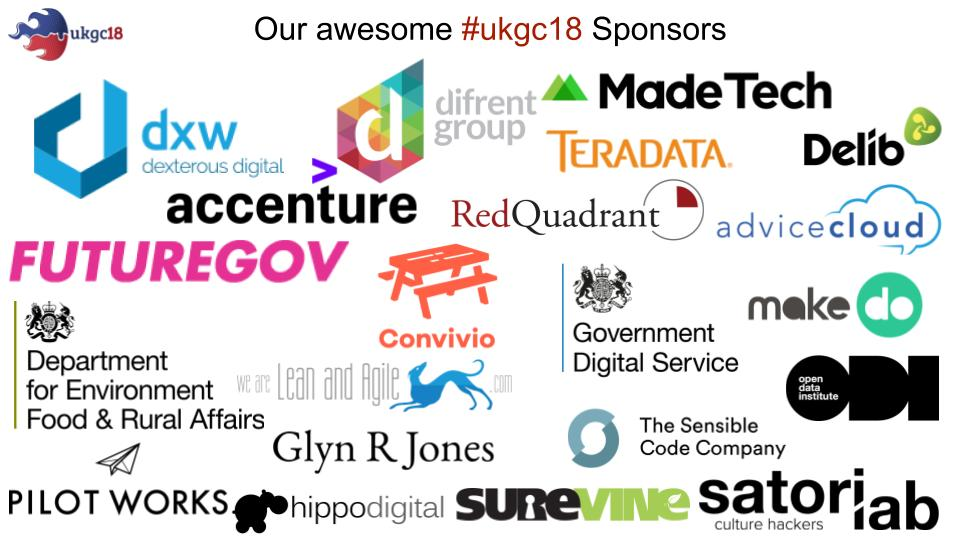
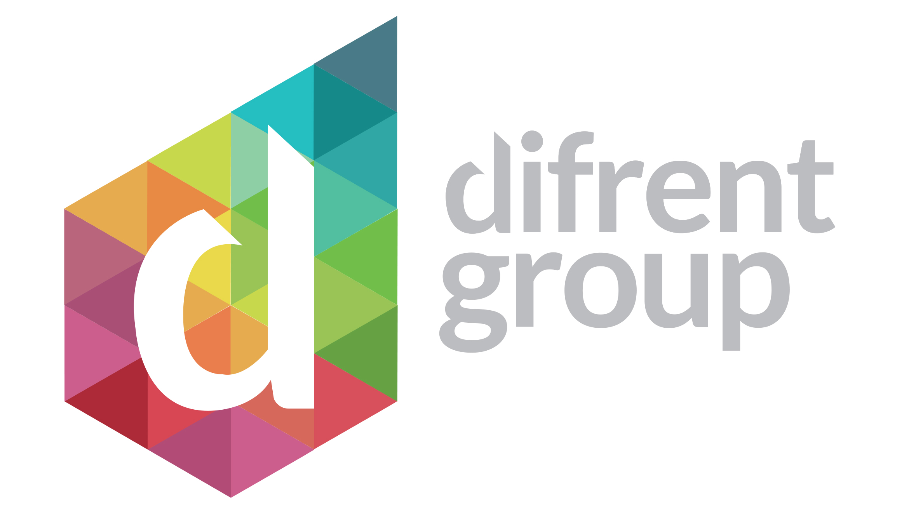
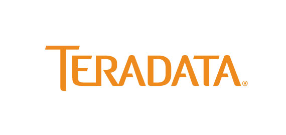

My, my, how time does indeed fly. In the blink of an eye we find ourselves with only days to go till [#ukgc18](https://twitter.com/hashtag/ukgc18?ref_src=twsrc%5Egoogle%7Ctwcamp%5Eserp%7Ctwgr%5Ehashtag) kicks off on Saturday the 20th of January, hosted by the kind folks at the [Ministry of Justice](https://www.google.co.uk/maps/place/Ministry+of+Justice/@51.4997614,-0.1370881,17z/data=!3m1!4b1!4m5!3m4!1s0x487604dbe92f5af3:0x43d424d396c6fa7!8m2!3d51.4997581!4d-0.1348994). The machine that is UKGovcamp is revving up and raring to go!

 

# **Thank you!**

We’ve had a great response from our call for Sponsorship, and we are truly humbled by the generosity of our many, many sponsors. Without sponsorship, UKGovcamp simply wouldn’t happen. Any additional money that is raised, is ploughed back into your community to help [fund other bar camps](https://www.ukgovcamp.com/category/support-events/) throughout the year to help your community grow.

#ukgcX 2018 Sponsors

* * *

We’d also like to give a shout out to our Pre & Post drinks Sponsors who will keep you fed and watered in the evening:

* * *

The sponsors of the pop up coffee and the lovely lunch on the day:

 

* * *

Keeping you hydrated with water bottles are:

 

 

* * *

and the UKGovcamp mugs make a comeback this year thanks to:

## 

* * *

## **What do I do at Govcamp?**

A few folk who haven’t been to UKGovcamp before have been asking what they need to do on the day. Have a read of these blog posts from previous Govcamps and fellow campers, which should give you an idea of what to expect. They capture it perfectly, better than I could.

- From [Stefan Czerniawski](http://publicstrategist.com/2015/01/camping-trip/)
- From [Lucy Knight](https://geekwonkinterface.wordpress.com/2016/06/14/its-ok/)
- From [Steve Parks at Convivio](https://blog.weareconvivio.com/what-to-expect-at-ukgovcamp-ecc37191dc81) 

The day is for you.

It’s a unique experience, that you shape.

No two people have the same experience. You’re already awesome just for being part of [#ukgc18](https://twitter.com/hashtag/ukgc18?ref_src=twsrc%5Egoogle%7Ctwcamp%5Eserp%7Ctwgr%5Ehashtag).

The best advice is to Listen, Speak, Engage and Enjoy!

If you wanted to know more about pitches and sessions on the day, check out [our post from last year on what to expect and how to pitch.](https://www.ukgovcamp.com/2017/01/15/pitch-and-run-at-ukgcx/) It should help you get an idea of what's expected and what is going to happen.

* * *

 

## **LOGISTICS**

### **Friday Night**

pre-[#ukgc18](https://twitter.com/hashtag/ukgc18?ref_src=twsrc%5Egoogle%7Ctwcamp%5Eserp%7Ctwgr%5Ehashtag) drinks will be held in the [The Old Star (a couple of minutes walk from the MoJ)](https://www.google.co.uk/maps/place/Old+Star/@51.4999304,-0.135975,17z/data=!3m1!4b1!4m5!3m4!1s0x487604dbeddda95b:0xdfdc4e49133adb59!8m2!3d51.4999271!4d-0.1337863) on Friday night from 6pm, for any #ukgc18 folk who are around in London, or perhaps travelling down to London to stay overnight. [There's a Facebook event for your calendar if you'd like to RSVP.](https://www.facebook.com/events/311156836061646/)

I’m sure there will be folk there till late, so do please pop in and perhaps start some of those [#ukgc18](https://twitter.com/hashtag/ukgc18?ref_src=twsrc%5Egoogle%7Ctwcamp%5Eserp%7Ctwgr%5Ehashtag) conversations early! We’ll be in the  the pub and looking forward to meeting you. Pre-[#ukgc18](https://twitter.com/hashtag/ukgc18?ref_src=twsrc%5Egoogle%7Ctwcamp%5Eserp%7Ctwgr%5Ehashtag) Drinks & nibble sponsored by the lovely folks from [@BeDifrent](https://twitter.com/bedifrent)

Keep an eye out for the UKGovcamp team [@baskers,](https://www.twitter.com/baskers) [@jacattell](https://www.twitter.com/jacattell),  [@veewilliams\_](https://www.twitter.com/veewilliams_),  [@ayymanduh](https://www.twitter.com/ayymanduh),  [@DavidBuckster](https://www.twitter.com/davidbuckster),  [@cholten99](https://www.twitter.com/cholten99), [@CrabLabuk,](https://www.twitter.com/crablabuk) [@JanetHughes](https://www.twitter.com/janethughes),  [@musdotmo](https://www.twitter.com/musdotmo) in the pub and come join us to kick off [#ukgc18](https://twitter.com/hashtag/ukgc18?ref_src=twsrc%5Egoogle%7Ctwcamp%5Eserp%7Ctwgr%5Ehashtag) early :)

 

* * *

### **Saturday – On the day**

- Doors open: 9am
- IF YOU DONT HAVE A GOVERMENT PASS PLEASE REMEMBER TO BRING ID WITH YOU, SOMETHING WITH YOUR NAME ON IT LIKE A BANK CARD ETC.
- Session pitches start: 10am
- After the pitches are finished we’ll update the [Session Grid](https://docs.google.com/spreadsheets/d/1S6nemSPxSLrURGigaQZFKViWBoAhalpE2f0RtZ92Fpk/pubhtml), with all the Talks, Room allocations and links to the live blogs.

**Please do make sure that you arrive no later than 9:30am as we’ve a lot to get through on the day and we will be starting at 9:45am sharp.**

Camp makers will be onsite to help us keep everything running smoothly (these folks rock!). There will be water, coffee and lunch provided. If you don’t like whats on offer, there are plenty of eatery places around the MoJ  if you wanted to pop out at lunchtime to grab something.

* * *

### Need a bit of quiet?

We recognise that unconferences such as UKGovcamp can be particularly overwhelming, full of people and lots of noise. Not all of us comfortable with that, so we've set a room aside that can be used as a "quiet" room if you just want to be alone with your thoughts, or just need a bit of peace and quiet to recharge the old brain cells. Room 6 shall be the quiet room.

 

* * *

### Tweeting and blogging!

We’ll be live blogging and tweeting, campers will be tweeting, taking pictures, taking video, live streaming as [#ukgc18](https://twitter.com/hashtag/ukgc18?ref_src=twsrc%5Egoogle%7Ctwcamp%5Eserp%7Ctwgr%5Ehashtag) happens on and offline!

- For each session and room there will be a dedicated hashtag (to help sort out the information from all the wider [#ukgc18](https://twitter.com/hashtag/ukgc18?ref_src=twsrc%5Egoogle%7Ctwcamp%5Eserp%7Ctwgr%5Ehashtag) noise) as we will get spammed once [#ukgc18](https://twitter.com/hashtag/ukgc18?ref_src=twsrc%5Egoogle%7Ctwcamp%5Eserp%7Ctwgr%5Ehashtag) starts trending. It happens every year, bombarded with diet pills and boobs.
- It works like this:
    - General = #ukgc18Session = #ukgc18 + s\_ + r\_s\_ = 1, 2, 3, 4 or 5r\_ = R1, R2, R3, R4, eg; Session 1, Room 1 = #ukgc18s1r1
    - But don't worry, we will have campmakers live blogging each session and there will be reminders of what hashtag we are using for that session.

We are archiving your [#ukgc18](https://twitter.com/hashtag/ukgc18?ref_src=twsrc%5Egoogle%7Ctwcamp%5Eserp%7Ctwgr%5Ehashtag) tweets that you can find here:

- [#ukgc18 Archived Tweets](https://docs.google.com/spreadsheets/d/e/2PACX-1vSUHX2ybkCUB1XIAXj5EHFSVpM1XOzK7h9NlXUEi-PMUw7E46AgD2cVEx_WL8HQNBuz2f2loMgEUYvS/pubhtml?gid=349751605&single=true) 
- [Session 1 Tweets](https://docs.google.com/spreadsheets/d/e/2PACX-1vQTDYIfN5c41pra6xxqCoDS5UiLhelqGvRKPCY-EwzkrnFST04d2GiTJdjRaVWJ87tpVdGV-Gvjq03P/pubhtml?gid=1083675254&single=true)
- [Session 2 Tweets](https://docs.google.com/spreadsheets/d/e/2PACX-1vR8H1_NhSQghF0GoJlYGGQBhugz2JSCtzp7z9wriDMJPgmSFKobYA8NgIH2ARTfhploDUoPRmrfDsGB/pubhtml?gid=1977973654&single=true)
- [Session 3 Tweets](https://docs.google.com/spreadsheets/d/e/2PACX-1vTxWPMBCTDqOLOYc4xdPmBlol6cSHLM7dl-NAMHPWFX9pLoS4a8OJL30VTyxjP8A-UatNfmQiIWIqxW/pubhtml?gid=2119067591&single=true)
- [Session 4 Tweets](https://docs.google.com/spreadsheets/d/e/2PACX-1vQi4iuyoE6Gvs4mai0yIHjsk73Jg-Xc0EstMThHxPHVeRFoI9HNQiOP5OrcvbQAOKSFauaiDXzdAI5h/pubhtml?gid=1175165718&single=true)
- [Session 5 Tweets](https://docs.google.com/spreadsheets/d/e/2PACX-1vQBr4vjZFuudc5l9D-6GO3DxpeZvYpBA3qh7Ob3grkYmfQLEllfpWLU-TZAEFQOC38fKloVyzL48yyz/pubhtml?gid=1716909095&single=true)

There’s also the [#ukgc18 Twitter List](https://twitter.com/UKGovCamp/lists/ukgovcamp-2018-attendees) for you to follow to make it easier to see who’s tweeting about [#ukgc18](https://twitter.com/hashtag/ukgc18?ref_src=twsrc%5Egoogle%7Ctwcamp%5Eserp%7Ctwgr%5Ehashtag), and then we look to bring the day to a close, back to the Auditorium for:

- Wrap up: 4:40pm

* * *

### **Saturday – In the Evening**

- Pub - [The Old Star (a couple of minutes walk from the MoJ)](https://www.google.co.uk/maps/place/Old+Star/@51.4999304,-0.135975,17z/data=!3m1!4b1!4m5!3m4!1s0x487604dbeddda95b:0xdfdc4e49133adb59!8m2!3d51.4999271!4d-0.1337863): 5pm to continue on the conversation of [#ukgc18](https://twitter.com/hashtag/ukgc18?ref_src=twsrc%5Egoogle%7Ctwcamp%5Eserp%7Ctwgr%5Ehashtag) with drinks and food provided until the bar tab runs dry.
- We will be taking over the upstairs of the pub, and some of the downstairs area to save the stairs for those folks  like myself who have mobility issues.
- Many thanks to [@dxw](https://twitter.com/dxw) for sponsoring the post-[#ukgc18](https://twitter.com/hashtag/ukgc18?ref_src=twsrc%5Egoogle%7Ctwcamp%5Eserp%7Ctwgr%5Ehashtag) drinks & nibbles! But once the that bar tab runs dry then you'll have to buy your own :)

* * *

### **Sunday and beyond**

Your brain will probably be buzzing after [#ukgc18](https://twitter.com/hashtag/ukgc18?ref_src=twsrc%5Egoogle%7Ctwcamp%5Eserp%7Ctwgr%5Ehashtag). Rest up. Take time out to pause and reflect on your experience, us organisers and campmakers will certainly need a wee rest afterwards, once we can get our brains to stop buzzing!

It would be great to hear back from you on what sparked your interest? What did you learn? Who did you meet? What did you want to do differently?  Please blog and tweet about [#ukgc18](https://twitter.com/hashtag/ukgc18?ref_src=twsrc%5Egoogle%7Ctwcamp%5Eserp%7Ctwgr%5Ehashtag).

We’ll be building up the [Pinterest board](https://www.pinterest.co.uk/ugovcamp/ukgovcamp-2018/) of all your posts to share with our community, and also be sending out a post event survey to help capture your valuable feedback.

SaveSave
