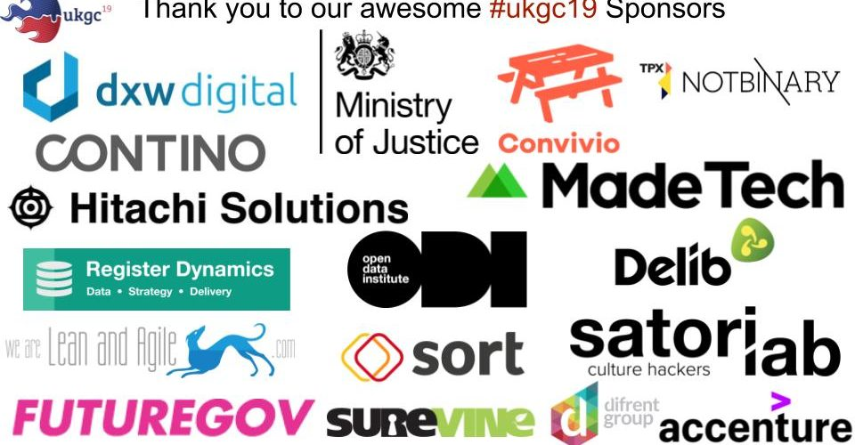

TL;DR: **Hashtag** \= #ukgc19. **Venue** \= Ministry of Justice, London SW1H 9AJ. **Timings** \= Doors open 0900, pitching 1000, doors close 1700

My, my, how time does indeed fly. In the blink of an eye we find ourselves with only days to go till [#ukgc19](https://twitter.com/hashtag/ukgc19?ref_src=twsrc%5Egoogle%7Ctwcamp%5Eserp%7Ctwgr%5Ehashtag) kicks off on Saturday the 19th of January from 9am, hosted by the kind folks at the [Ministry of Justice](https://www.google.co.uk/maps/place/Ministry+of+Justice/@51.4997614,-0.1370881,17z/data=!3m1!4b1!4m5!3m4!1s0x487604dbe92f5af3:0x43d424d396c6fa7!8m2!3d51.4997581!4d-0.1348994).

The machine that is UKGovcamp is revving up and raring to go!

It’s a year of firsts - having done away with sponsored swag we are focusing on making the day as accessible for all as possible. For the first time we are providing a creche (details further below) if you have some young ones you’d like to bring along on the day. We have also introduced travel and accommodation bursaries to enable as many people as possible to attend. Also, in another first, we are also trialling #BookSwap so bring a book you would like to share.

Bring one - take one! (The books, not the children obviously!)

* * *

 

## **Thank you!**

We’ve had a great response from our call for Sponsorship, and we are truly humbled by the generosity of our many, many sponsors. Without sponsorship, UKGovcamp simply wouldn’t happen. Any additional money that is raised, is invested back into your community to help [fund other bar camps](https://www.ukgovcamp.com/category/support-events/) throughout the year to help your community grow.

 

We’d also like to give a shout out to our Pre & Post drinks Sponsors who will keep you fed and watered in the evening:

* * *

 

Your essential coffee needs have been made possible by:

* * *

 

And these fine folks have made your #ukgc19 lunch a tasty treat:

* * *

 

And a tip o' the hat to :

For providing the sponsorship that is funding our very first creche this year!

* * *

 

Finally many thanks to:

for providing an online platform for our session grid.

* * *

## **What do I do at Govcamp?**

A few folk who haven’t been to UKGovcamp before have been asking what they need to do on the day. Have a read of these blog posts from previous Govcamps and fellow campers, which should give you an idea of what to expect. They capture it perfectly, better than I could.

- From [Stefan Czerniawski](http://publicstrategist.com/2015/01/camping-trip/)
- From [Lucy Knight](https://geekwonkinterface.wordpress.com/2016/06/14/its-ok/)
- From [Steve Parks at Convivio](https://blog.weareconvivio.com/what-to-expect-at-ukgovcamp-ecc37191dc81)

The day is for you.

It’s a unique experience, that you shape.

No two people have the same experience. You’re already awesome just for being part of [#ukgc19](https://twitter.com/hashtag/ukgc19?ref_src=twsrc%5Egoogle%7Ctwcamp%5Eserp%7Ctwgr%5Ehashtag).

The best advice is to Listen, Speak, Engage and Enjoy!

If you wanted to know more about pitches and sessions on the day, check out [our post from last year on what to expect and how to pitch.](https://www.ukgovcamp.com/2017/01/15/pitch-and-run-at-ukgcx/) It should help you get an idea of what’s expected and what is going to happen.

* * *

## **LOGISTICS**

## **Friday Night**

pre-[#ukgc19](https://twitter.com/hashtag/ukgc19?ref_src=twsrc%5Egoogle%7Ctwcamp%5Eserp%7Ctwgr%5Ehashtag) drinks will be held in the [The Old Star (a couple of minutes walk from the MoJ)](https://www.google.co.uk/maps/place/Old+Star/@51.4999304,-0.135975,17z/data=!3m1!4b1!4m5!3m4!1s0x487604dbeddda95b:0xdfdc4e49133adb59!8m2!3d51.4999271!4d-0.1337863) on Friday night from 6pm, We’ve got a cove downstairs reserved for any [#ukgc19](https://twitter.com/hashtag/ukgc19?ref_src=twsrc%5Egoogle%7Ctwcamp%5Eserp%7Ctwgr%5Ehashtag) folk who are around in London, or perhaps travelling down to London to stay overnight.

I’m sure there will be folk there till late, so do please pop in and perhaps start some of those [#ukgc19](https://twitter.com/hashtag/ukgc19?ref_src=twsrc%5Egoogle%7Ctwcamp%5Eserp%7Ctwgr%5Ehashtag) conversations early!

We’ll be in the pub and looking forward to meeting you.

Keep an eye out for the UKGovcamp team [@baskers,](https://www.twitter.com/baskers) [@jacattell](https://www.twitter.com/jacattell),  [@veewilliams\_](https://www.twitter.com/veewilliams_),  [@ayymanduh](https://www.twitter.com/ayymanduh), [@DavidBuckster](https://www.twitter.com/davidbuckster), [@cholten99](https://www.twitter.com/cholten99), [@CrabLabuk,](https://www.twitter.com/crablabuk) [@JanetHughes](https://www.twitter.com/janethughes), [@mxhm9](https://twitter.com/mxhm9) in the pub and come join us to kick off [#ukgc19](https://twitter.com/hashtag/ukgc19?ref_src=twsrc%5Egoogle%7Ctwcamp%5Eserp%7Ctwgr%5Ehashtag) early ?

* * *

### **Saturday – On the day**

- Doors open: 9am

**IF YOU DON'T HAVE A GOVERNMENT PASS PLEASE REMEMBER TO BRING ID WITH YOU, SOMETHING WITH YOUR NAME ON IT LIKE A BANK CARD ETC.**

- Session pitches start: 10am
- After the pitches are finished we’ll update the [Session Grid](https://docs.google.com/spreadsheets/d/1S6nemSPxSLrURGigaQZFKViWBoAhalpE2f0RtZ92Fpk/pubhtml), with all the Talks, Room allocations and links to the live blogs. There will also be a more mobile friendly version of the session grid, which can be found here: [https://ukgc19.weareconvivio.com/](https://ukgc19.weareconvivio.com/) Big thanks to Convivio for providing an online platform for our session grid.

**Please do make sure that you arrive no later than 9:30am as we’ve a lot to get through on the day and we will be starting at 9:45am sharp.**

Camp makers will be onsite to help us keep everything running smoothly (these folks rock, and you can easily identify them by the UKGovcamp sashes they will be wearing!). There will be water, coffee and lunch provided. If you don’t like what’s on offer, there are plenty of eatery places around the MoJ if you wanted to pop out at lunchtime to grab something.

 

* * *

## **Bringing your child to #ukgc19? Here’s what you need to know**

We’ve choosening creche provider [NipperBout](https://www.nipperbout.com/) who were recommended to us by [EMF Camp](https://www.emfcamp.org/).

[PLEASE MAKE SURE THAT YOU HAVE REGISTERED FOR A CRECHE PLACE FOR YOUR CHILD](https://www.ukgovcamp.com/wp-content/uploads/2019/01/Parents-How-To.pdf).

- Crèche drop off if from 9am in the morning and pick up is no later than 5pm.
- Parents, you’ll need to bring a pack lunch for your child - this is probably the safest option as you’ll know what your child likes or doesn’t like
- Please bring warm/outdoor clothes for your child as the creche staff will take them out for a walk in the park at some point in the day (weather permitting).
- The Crèche will be held in conference room 4.

* * *

## **Need a bit of quiet?**

We recognise that unconferences such as UKGovcamp can be particularly overwhelming, full of people and lots of noise. Not all of us comfortable with that, so we’ve set a room aside that can be used as a “quiet” room if you just want to be alone with your thoughts, or just need a bit of peace and quiet to recharge the old brain cells. **Conference room 10 shall be the quiet room.**

 

* * *

## **Tweeting and blogging!**

We’ll be live blogging and tweeting, campers will be tweeting, taking pictures (there will be different coloured Lanyrds for you to choose from, Blue if you don’t mind your picture being taken, and Orange if you’d rather not have your photo take), taking video, live streaming as [#ukgc19](https://twitter.com/hashtag/ukgc19?ref_src=twsrc%5Egoogle%7Ctwcamp%5Eserp%7Ctwgr%5Ehashtag) happens on and offline!

- For each session and room there will be a dedicated hashtag (to help sort out the information from all the wider [#ukgc19](https://twitter.com/hashtag/ukgc19?ref_src=twsrc%5Egoogle%7Ctwcamp%5Eserp%7Ctwgr%5Ehashtag) noise) as we will get spammed once [#ukgc19](https://twitter.com/hashtag/ukgc19?ref_src=twsrc%5Egoogle%7Ctwcamp%5Eserp%7Ctwgr%5Ehashtag) starts trending. It happens every year, bombarded with diet pills and boobs.
- It works like this:
    - General = #ukgc19Session = #ukgc19 + s\_ + r\_s\_ = 1, 2, 3, 4 or 5r\_ = R1, R2, R3, R4, **eg; Session 1, Room 1 = #ukgc19s1r1**
    - But don’t worry, we will have campmakers live blogging each session and there will be reminders of what hashtag we are using for that session.

There’s also the [Twitter List](https://twitter.com/UKGovCamp/lists/ukgovcamp-2019-attendees) for you to follow to make it easier to see who’s tweeting about [#ukgc19](https://twitter.com/hashtag/ukgc19?ref_src=twsrc%5Egoogle%7Ctwcamp%5Eserp%7Ctwgr%5Ehashtag), and then we look to bring the day to a close, back to the Auditorium for:

- Wrap up: 4:40pm

* * *

## **Saturday – In the Evening**

- The Pub is – [The Old Star (a couple of minutes walk from the MoJ)](https://www.google.co.uk/maps/place/Old+Star/@51.4999304,-0.135975,17z/data=!3m1!4b1!4m5!3m4!1s0x487604dbeddda95b:0xdfdc4e49133adb59!8m2!3d51.4999271!4d-0.1337863):
- We shall head there for 5pm to continue on the conversation of [#ukgc19](https://twitter.com/hashtag/ukgc19?ref_src=twsrc%5Egoogle%7Ctwcamp%5Eserp%7Ctwgr%5Ehashtag) with drinks and food provided until the bar tab runs dry thanks to dxw ditgial

 

- We will be taking over the upstairs of the pub, and some of the downstairs area to save the stairs for those folks like myself who have mobility issues.
- Many thanks to [@dxw](https://twitter.com/dxw) for sponsoring the post-[#ukgc19](https://twitter.com/hashtag/ukgc19?ref_src=twsrc%5Egoogle%7Ctwcamp%5Eserp%7Ctwgr%5Ehashtag) drinks & nibbles! But once the that bar tab runs dry then you’ll have to buy your own ?

* * *

### **Sunday and beyond**

Your brain will probably be buzzing after [#ukgc19](https://twitter.com/hashtag/ukgc19?ref_src=twsrc%5Egoogle%7Ctwcamp%5Eserp%7Ctwgr%5Ehashtag). Rest up. Take time out to pause and reflect on your experience, us organisers and campmakers will certainly need a wee rest afterwards, once we can get our brains to stop buzzing!

It would be great to hear back from you on what sparked your interest? What did you learn? Who did you meet? What did you want to do differently?  

Please blog and tweet about [#ukgc19](https://twitter.com/hashtag/ukgc19?ref_src=twsrc%5Egoogle%7Ctwcamp%5Eserp%7Ctwgr%5Ehashtag). Share your experiences with the community and keep the conversation going long after [#ukgc19](https://twitter.com/hashtag/ukgc19?ref_src=twsrc%5Egoogle%7Ctwcamp%5Eserp%7Ctwgr%5Ehashtag) is but a distant memory.
