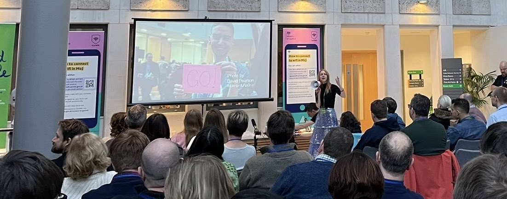

### 

 

### Exciting news! We’re returning in person, in London on **Saturday 20th January 2024**, and **ticket registration is now open!**  We’re going to have 500 places, so we won’t be running our usual lottery, but please do **[register now](https://forms.gle/9pQb6yThR5q24qsWA)** to avoid any disappointment.

### **But first, what is UKGovcamp?**

GovCamp is an unconference - an event with no agenda - where attendees shape the day. You can see what’s been discussed at past Govcamps [here](https://docs.google.com/spreadsheets/d/1S6nemSPxSLrURGigaQZFKViWBoAhalpE2f0RtZ92Fpk/edit#gid=11), and the following blog posts should give you an idea of what to expect.

- From [Steve Parks](https://blog.weareconvivio.com/what-to-expect-at-ukgovcamp-ecc37191dc81)
- From [Lucy Knight](https://geekwonkinterface.wordpress.com/2016/06/14/its-ok/)
- From [Debbie Blanchard](https://dwpdigital.blog.gov.uk/2018/02/19/sharing-what-i-learnt-at-ukgovcamp/)
- From [Dan Barrett](https://medium.com/@dasbarrett/uk-govcamp-2019-reflections-c2eb14c782a2)
- From [Sam Villis](https://medium.com/@stamanfar/notes-from-govcamp-ukgc19-37dbb84de739)

### **Did you say bigger?**

Yes, you heard right, it’s going to be bigger and better! Previously, we’ve kept our event to 250 people but this year we wanted to try and accommodate all of our current community AND encourage even more new attendees from across the public sector. We hope this will encourage new pitch topics and a fresh take on our event.

### **Will you be hosting more than one event this year?**

We plan to also host an online UKGovcamp on a separate date, most likely in Spring 2024.  

You can add your interest in the ticket registration form (even if you don’t plan on coming to the in-person London event)

### **We’re committed to making UKGovcamp a diverse, inclusive and welcoming community**

- We aim to create a diverse and inclusive environment, and to help us do this **we collect diversity data.** This data is intended to give us a picture of our strengths, and identify areas where we can improve to make these events more inclusive.  Providing this data is always optional. It is completely up to you if you’d like to share that information with us. 
- We’ve provided a **crêche and bursaries** to help people attend since 2019, and we’re delighted to be able to provide these again.  You’ll be able to indicate what you need in the registration form. Crêche places are limited, and on a first-come, first-serve basis, so do register as soon as you can.
- We provided a BSL Interpreter last year and would be more than happy to do so again. If this or any other services are required to allow you to attend, please contact [organisers@ukgovcamp.com](mailto:organisers@ukgovcamp.com) to discuss them with us so we can make best use of our accessibility fund.
- You’ll also be able to share in the registration form if there’s **anything you need that would help you to participate**. We will always try our best to accommodate everyone.  
- As always, we’re reviewing our code of conduct and accessibility statement ahead of the event, and will publish these as soon as possible.
- UKGovcamp is run by a small group of volunteers in our spare time. We’re grateful for our generous sponsors who play a crucial role in making this event possible.

### **How you can be involved!** 

- You can **become a sponsor** and help us to make this fabulous event happen! We have a range of sponsorship packages, please see [our sponsor page](https://www.ukgovcamp.com/become-a-sponsor/) for more details.
- You can **volunteer** \- as a Campmaker - to help run the event on the day, and you can share your interest via the form.
- You can **share information** about UKGovcamp so we can spread the word far and wide and hopefully reach even more people.
