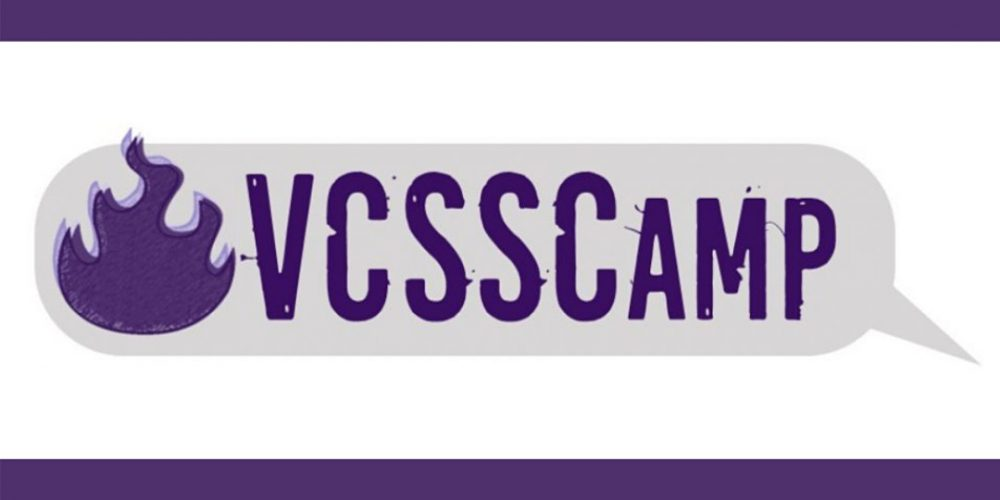

GovCamp North have successfully applied to the UKGovCamp grant fund and will receive £1000. Below is their application:

**Name of applicant: Pauline Roche**

**Description of the event:** Unconference for people from VCS Local Infrastructure Organisations (Councils for Voluntary Services and Volunteer Centres etc) and our supporters to meet and talk about the ways we use (or don’t use) digital tools and technology in our work, especially since the Covid19 pandemic started; the main attendees will be from London-based organisations

**How much funding are you looking for?** £500

**What do you expect the funding will be used for?**

For experimenting with different tech and getting support to set this up beforehand and on the day if necessary

**Finally, please tell us a bit about yourself, what you do, and your interest in running this event:** I am a producer, relationship broker, freelance journalist and info professional, increasing the digital and data confidence and literacy of people in community-led organisations; I co-founded VCSSCamp in 2013 with 2 others like me who saw a gap in the market for staff and trustees (Board Members) of Local Infrastructure Organisations (LIOs) to have an opportunity to get together and discuss issues and initiatives concerning information, communication and the role of Digital Technology. I have run 8 VCSSCamps so far with admin & finance support provided by Ted Ryan, and various other team members (co-founders Lorna Prescott and Paul Webster, Eileen Fielding & Becky Pickin (Dudley CVS – VCSSCamps 1,2, & 4), Carolyn Ellis (Barnsley CVS – VCSScamp 3) and Kate White (Superhighways – VCSSCamp 5 & 8); I think lockdown gives us an opportunity to trial run the event online, thus enabling us to experiment with technology which might be useful to attendees for future events
