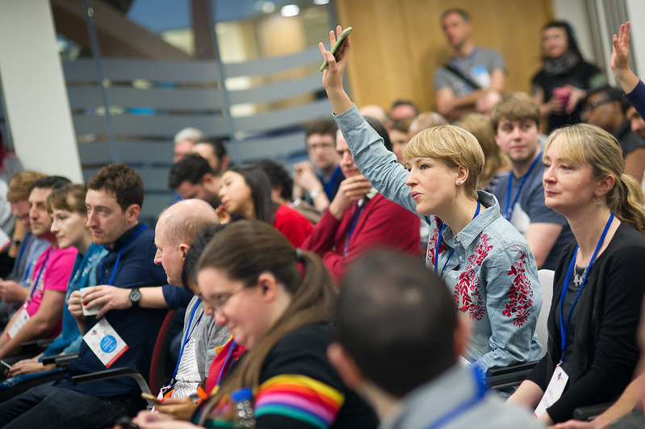

This year UK Gov Camp and Gov Camp North have teamed together to bring you a festival of events both online and in person as follows:

- Tuesday 17 January 2023 - Gov Camp North in Barnsley.
- Thursday 19 January 2023 - our combined online event.
- Saturday 21 January 2023 - UK Gov Camp in Central London.

All the events will run as separate unconferences where the topics will be agreed by attendees.

 Photo by W N Bishop - https://flic.kr/p/22moxQx

**To sign up for any of these events please complete our [online form](https://docs.google.com/forms/d/e/1FAIpQLSexRBX1YM3mRw4WlFjlzkAttKjqx92xbDAqywfzI8wLJ3Cu1A/formResponse).**

The theme is public sector digital, data, culture, technology and operations.

You can see a list of sessions from previous UK Gov Camp events at: [https://bit.ly/UKGovcampSessionGrid](https://bit.ly/UKGovcampSessionGrid)

If you'd like to sponsor or volunteer for any of the events, you can do so in the online form.

Please note that the online form will remain open until just before the event, but space for UK Gov Camp is limited and you'll be entered into a lottery, which closes on the 23:59 Saturday 5 November 2022.

Thanks again and look forward to seeing you.

Your gov camp organisers.
